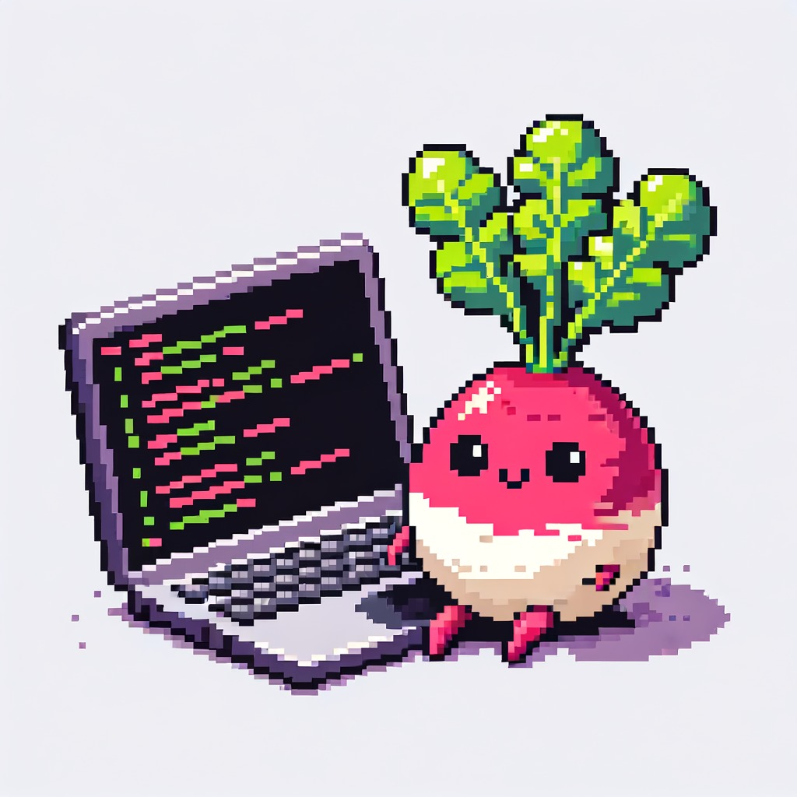

# Radish



Radish is a didactical exercise to replicate an in-memory Database, we decided to use Redis as the case study so we are trying to implement some of the redis functionalities with different interfaces.
Radish is fully developed in Julia with minor external dependencies.


Structure of the project
```
Radish
├─ LICENSE
├─ Project.toml
├─ README.md
├─ Radish.jl
├─ bench.jl
├─ hello.jl
├─ runner.jl
└─ src
   ├─ main_loop.jl
   ├─ radishelem.jl
   └─ rstrings.jl

```