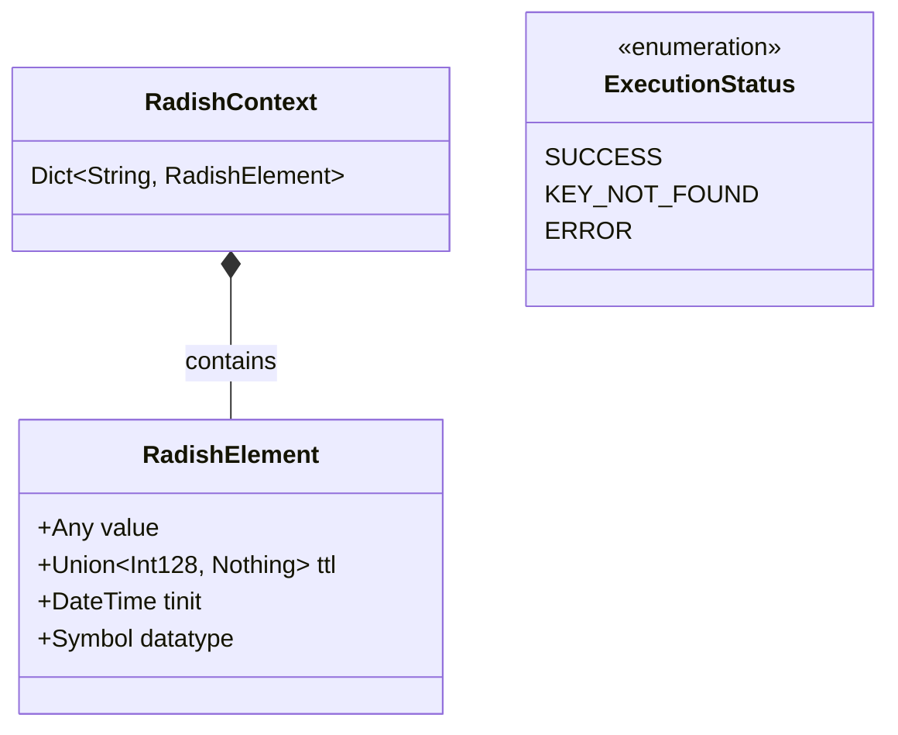
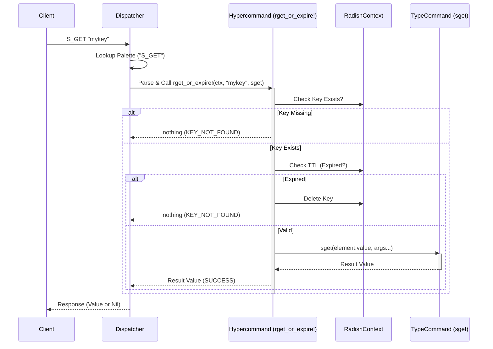
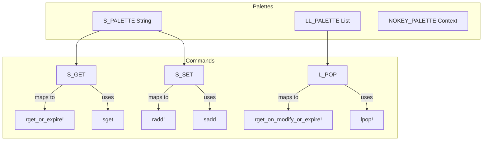

# Radish Architecture

## Core Data Structures

## Hypercommand Execution Flow

This sequence diagram illustrates how a command (e.g., `S_GET`) is processed through the delegation pattern.

## Command Palette Structure

