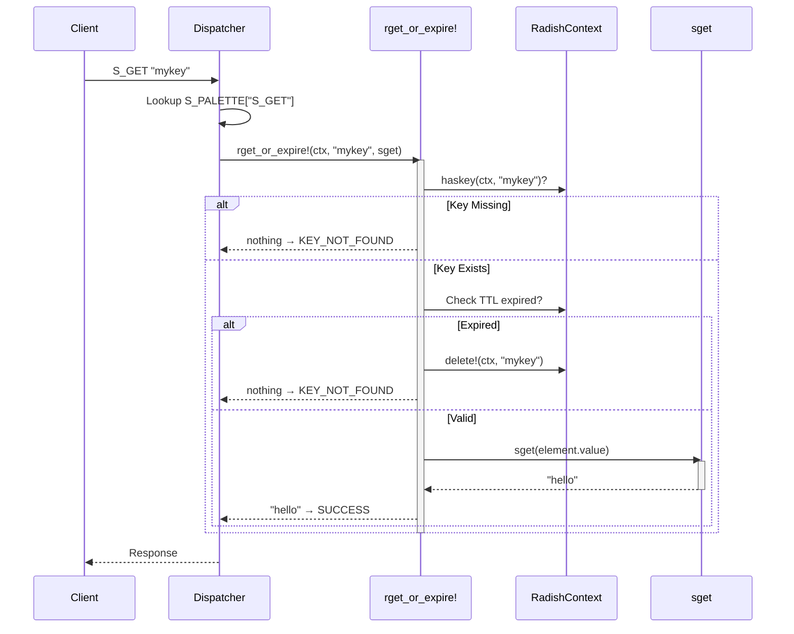

# Architecture: The Delegation Pattern

Radish's architecture is built around a **delegation pattern** — a design where generic operations (called *hypercommands*) handle the common logic (locking, TTL checking, key lookup), and delegate the type-specific work to smaller *type commands*.

This is the single most important design decision in Radish: it makes the system extensible, testable, and easy to reason about.

---

## Core Data Model

Everything in Radish lives in a `RadishContext`, which is simply a dictionary:

```julia
RadishContext = Dict{String, RadishElement}
```

Each value is wrapped in a `RadishElement`:

```julia
mutable struct RadishElement
    value::Any              # The actual data (String, DLinkedStartEnd, etc.)
    ttl::Union{Int128, Nothing}  # Time To Live in seconds, or nothing
    tinit::DateTime         # Timestamp of creation
    datatype::Symbol        # Type identifier (:string, :list, etc.)
end
```

The key insight is the **`datatype` field**. Instead of using Julia's type system to distinguish between values, Radish uses a symbol tag. This is because Radish data types are semantic abstractions rather than native Julia types — similar to Redis, where a string can be interpreted as an integer, a serialized list, or any other encoded value depending on the operation. 

{: .note }
> Redis uses a similar approach internally — each Redis object carries a type tag and an encoding tag that determine how the value is stored and manipulated.

---

## Hypercommands

Hypercommands are the core abstraction. At the moment there are 10 of them, and it's possible to add new hypercommands whenever you need a behavior that isn't yet designed.

The current implementation consists of the following commands:

| Hypercommand | Purpose | Example Use |
|---|---|---|
| `rget_or_expire!` | Read a value | `S_GET`, `L_LEN` |
| `rget_on_modify_or_expire!` | Read-and-modify in one operation | `S_GINCR` |
| `rget_on_modify_or_expire_autodelete!` | Read-modify with auto-cleanup of empty structures | `L_POP`, `L_DEQUEUE` |
| `radd!` | Add a new key | `S_SET`, `L_ADD` |
| `radd_or_modify!` | Create or modify in-place | `L_PREPEND`, `L_APPEND` |
| `rmodify!` | Modify an existing key | `S_INCR`, `S_APPEND` |
| `rmodify_autodelete!` | Modify with auto-cleanup of empty structures | `L_TRIMR`, `L_TRIML` |
| `rdelete!` | Delete a key | Internal use |
| `relement_to_element` | Compare two keys | `S_LCS`, `S_COMPLEN` |
| `relement_to_element_consume_key2!` | Combine two keys, consuming the second | `L_MOVE` |

### Detailed Breakdown

- **`rget_or_expire!`** — This is the hypercommand used to retrieve already available information in the database. If only lookup is required and nothing else, this is the right one to use. It checks if the key exists, validates TTL, and returns the value without modification.

- **`rget_on_modify_or_expire!`** — Similar to `rget_or_expire!`, but it allows modifying the data structure after the get operation. This is useful for operations that need to read and mutate in a single atomic step (e.g., getting a value and then incrementing it).

- **`rget_on_modify_or_expire_autodelete!`** — Extends `rget_on_modify_or_expire!` with automatic cleanup. After modifying the element, it checks if the structure is empty (e.g., a list with no elements) and automatically deletes the key if so. Used for operations like `L_POP` and `L_DEQUEUE` that should remove empty lists.

- **`radd!`** — Adds a new key to the database. This enforces strict "create only" semantics.

- **`radd_or_modify!`** — More flexible than `radd!` — it creates the key if it doesn't exist, or modifies it if it does. Useful for append-style operations where you want to initialize or extend a data structure (e.g., append a value to a list; if the list doesn't exist, create it with that value).

- **`rmodify!`** — Modifies an existing key. If the key doesn't exist, the operation fails. This enforces "update only" semantics, preventing accidental key creation.

- **`rmodify_autodelete!`** — Similar to `rmodify!`, but automatically deletes the key if the modification results in an empty structure. Used for operations like `L_TRIMR` and `L_TRIML` that might reduce a list to zero elements.

- **`rdelete!`** — Simply removes a key from the database. Used internally by other hypercommands and meta commands.

- **`relement_to_element`** — Operates on two keys simultaneously, comparing or combining their values without modifying either. Used for operations like longest common subsequence (LCS) between two strings. The result of the operation is not stored but just returned.

- **`relement_to_element_consume_key2!`** — Similar to `relement_to_element`, but consumes (deletes) the second key after the operation. Useful for move operations where you want to transfer data from one key to another. This operation does not return the new element, it just overwrites the first key.

{: .note }
> Meta commands like `EXISTS`, `DEL`, `TYPE`, `TTL`, `PERSIST`, `EXPIRE`, `RENAME`, and `FLUSHDB` are implemented as standalone functions rather than using the hypercommand pattern, since they work uniformly across all data types.

### Hypercommand Signature

```julia
hypercommand(context::RadishContext, key::String, command::Function, args...)
```

The `command` parameter is the type-specific function — this is the delegation. The hypercommand handles:
1. **Key lookup** — does the key exist?
2. **TTL check** — has it expired? If so, delete it
3. **Type validation** — is the key the right type for this command?
4. Then it **calls the type command** with the element's value

Does everything make sense so far? I hope so...

Now, here's the missing piece: how do hypercommands know which type command to call? The answer is they don't — it's actually the other way around. Commands are mapped to `(type_command, hypercommand)` pairs through something called **palettes**.

See [Command Palettes](palettes) for the full reference, in the next section.

---
Following an example of how an invokation of a command works in details.

## Example: How `S_GET` Works



