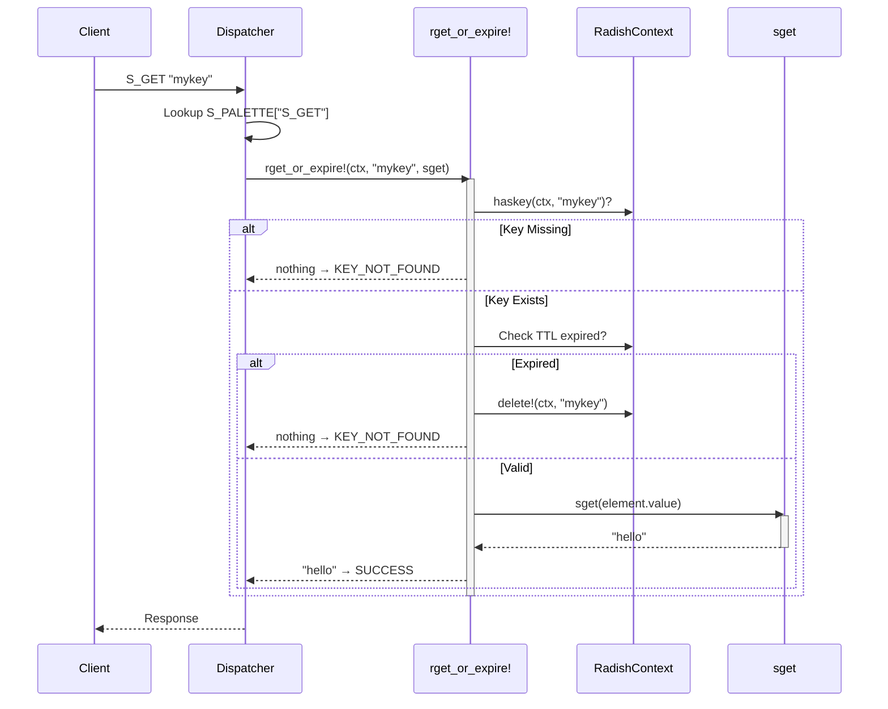

# Architecture: The Delegation Pattern

Radish's architecture is built around a **delegation pattern** — a design where generic operations (called *hypercommands*) handle the common logic (locking, TTL checking, key lookup), and delegate the type-specific work to smaller *type commands*.

This is the single most important design decision in Radish: it makes the system extensible, testable, and easy to reason about.

---

## Core Data Model

Everything in Radish lives in a `RadishContext`, which is simply a dictionary:

```julia
RadishContext = Dict{String, RadishElement}
```

Each value is wrapped in a `RadishElement`:

```julia
mutable struct RadishElement
    value::Any              # The actual data (String, DLinkedStartEnd, etc.)
    ttl::Union{Int128, Nothing}  # Time To Live in seconds, or nothing
    tinit::DateTime         # Timestamp of creation
    datatype::Symbol        # Type identifier (:string, :list, etc.)
end
```

The key insight is the **`datatype` field**. Instead of using Julia's type system to distinguish between string elements and list elements (which would require parameterized containers), Radish uses a symbol tag. This keeps the dictionary homogeneous while still enabling type validation at runtime.

{: .note }
> Redis uses a similar approach internally — each Redis object carries a type tag and an encoding tag that determine how the value is stored and manipulated.

---

## Hypercommands

Hypercommands are the core abstraction. There are 8 of them, and they cover every possible operation on the database:

| Hypercommand | Purpose | Example Use |
|---|---|---|
| `rget_or_expire!` | Read a value, checking TTL first | `S_GET`, `L_LEN` |
| `rget_on_modify_or_expire!` | Read-and-modify in one operation | `L_POP`, `L_DEQUEUE` |
| `radd!` | Add a new key (fail if exists) | `S_SET`, `L_ADD` |
| `radd_or_modify!` | Create or append | `L_PREPEND`, `L_APPEND` |
| `rmodify!` | Modify an existing key | `S_INCR`, `S_APPEND` |
| `rdelete!` | Delete a key | `DEL` |
| `relement_to_element` | Compare two keys | `S_LCS`, `S_COMPLEN` |
| `relement_to_element_consume_key2!` | Combine two keys, consuming the second | `L_MOVE` |

Every hypercommand follows the same signature pattern:

```julia
hypercommand(context::RadishContext, key::String, command::Function, args...)
```

The `command` parameter is the type-specific function — this is the delegation. The hypercommand handles:
1. **Key lookup** — does the key exist?
2. **TTL check** — has it expired? If so, delete it
3. **Type validation** — is the key the right type for this command?
4. Then it **calls the type command** with the element's value

### Example: How `S_GET` Works



---

## Command Palettes

Each data type has a **palette** — a dictionary mapping command names to `(type_command, hypercommand)` tuples:

```julia
S_PALETTE = Dict{String, Tuple}(
    "S_GET"     => (sget, rget_or_expire!),
    "S_SET"     => (sadd, radd!),
    "S_INCR"    => (sincr!, rmodify!),
    "S_APPEND"  => (sappend!, rmodify!),
    "S_LCS"     => (slcs, relement_to_element),
    # ... more string commands
)

LL_PALETTE = Dict{String, Tuple}(
    "L_ADD"     => (ladd!, radd!),
    "L_PREPEND" => (lprepend!, radd_or_modify!),
    "L_POP"     => (lpop!, rget_on_modify_or_expire!),
    # ... more list commands
)
```

This is the lookup table that the [dispatcher](dispatcher) uses to find the right pair. The beauty of this design is that **adding a new data type** is just:

1. Define the data structure (e.g., `HashTable`)
2. Write type commands (e.g., `hset!`, `hget`)
3. Create a palette mapping command names to `(type_command, hypercommand)` pairs
4. Register the palette in the dispatcher

The hypercommands don't change at all.

---

## Data Contracts

Radish enforces strict return value contracts to keep behavior predictable:

| Hypercommand | Returns on success | Returns on failure |
|---|---|---|
| `rget_or_expire!` | Element value | `nothing` |
| `rget_on_modify_or_expire!` | Modified value | `nothing` |
| `radd!` | `true` | `false` (key exists) |
| `radd_or_modify!` | Operation result | — |
| `rmodify!` | Result value | `nothing` (key not found) |
| `rdelete!` | `true` (deleted) | `false` (not found) |

These contracts are mapped to three execution statuses:

```julia
@enum ExecutionStatus begin
    SUCCESS          # Command executed, value returned
    KEY_NOT_FOUND    # Key doesn't exist or expired
    ERROR            # Wrong type, bad arguments, etc.
end
```

The rule is simple: `nothing` → `KEY_NOT_FOUND`, any other value → `SUCCESS`, exceptions → `ERROR`.

---

## Type Validation

Before executing a command, the [dispatcher](dispatcher) validates that the key holds the correct data type:

```julia
if haskey(ctx, cmd_key) && ctx[cmd_key].datatype != :string
    return ExecuteResult(false, nothing,
        "WRONGTYPE: Key '$(cmd_key)' holds a $(ctx[cmd_key].datatype), not a string")
end
```

This prevents accidental type mismatches — just like Redis's `WRONGTYPE` error. You can't run `S_GET` on a list key, or `L_POP` on a string key.
