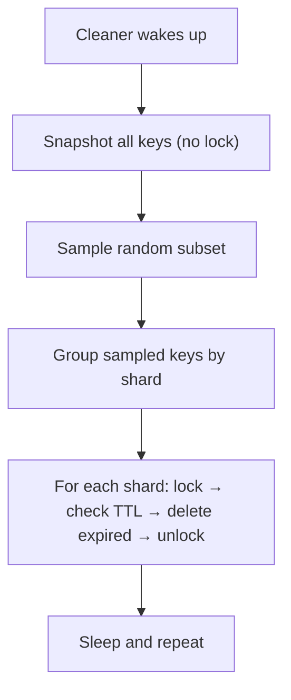

# Concurrency Model

This is where Radish diverges most significantly from Redis. **Redis is single-threaded** — it processes one command at a time, which elegantly avoids all concurrency issues. **Radish is multi-threaded** — multiple clients are served concurrently, which requires explicit synchronization.

This was a deliberate choice for the didactical goal: understanding concurrency primitives is essential for systems engineering, and Radish provides a real-world context to explore them.

---

## The Problem

When multiple clients access shared state concurrently, bad things can happen:

```
Client A: reads counter = 10
Client B: reads counter = 10
Client A: writes counter = 11
Client B: writes counter = 11    ← Should be 12!
```

This is a **race condition** — the classic lost-update problem. Radish needs to prevent this while keeping throughput high.

---

## Sharded Locking

Instead of a single global lock (which would serialize everything), Radish uses **sharded locking** — N independent `ReadWriteLock`s (configurable via [`num_lock_shards`](configuration), default 256):

```julia
struct ShardedLock
    shards::Vector{ReadWriteLock}
    num_shards::Int
end

ShardedLock(n::Int=256) = ShardedLock([ReadWriteLock() for _ in 1:n], n)
```

Each key is mapped to a shard using a hash:

```julia
shard_id(lock::ShardedLock, key::String) = (hash(key) % lock.num_shards) + 1
```

### Why 256 Shards?

The number of shards is [configurable](configuration) and controls the **granularity of contention**:

| Shards | Contention | Memory | Comment |
|---|---|---|---|
| 1 | Maximum — all operations serialized | Minimal | Equivalent to a global lock |
| 256 | Low — only keys on the same shard contend | Moderate | Good balance (default) |
| ∞ | Zero — per-key locking | High | Overkill for most workloads |

256 is a reasonable default — with uniform key distribution, two random keys have only a 1/256 ≈ 0.4% chance of contending with each other. You can tune this in `radish.yml` under `concurrency.num_lock_shards`.

### Read vs Write Locks

Each shard uses a `ReadWriteLock` from the ConcurrentUtilities package:

- **Read lock** — multiple readers can hold it simultaneously (e.g., `S_GET`, `L_LEN`)
- **Write lock** — exclusive access, no readers or other writers (e.g., `S_SET`, `L_POP`)

The [dispatcher](dispatcher) determines whether a command needs a read or write lock:

```julia
const READ_OPS = Set(["S_GET", "S_LEN", "S_GETRANGE", "L_GET", "L_LEN",
                       "L_RANGE", "KLIST", "EXISTS", "TYPE", "TTL", "DBSIZE"])
```

Anything not in `READ_OPS` requires a write lock.

---

## Ordered Lock Acquisition

When multiple locks are needed (multi-key operations or transactions), locks must be acquired in a **consistent order** to prevent deadlocks:

```julia
function acquire_write!(lock::ShardedLock, key_list::Vector{String})
    shard_ids = unique(sort([shard_id(lock, k) for k in key_list]))
    for id in shard_ids
        Base.lock(lock.shards[id])
    end
    return shard_ids
end
```

And released in **reverse order**:

```julia
function release_write!(lock::ShardedLock, shard_ids::Vector)
    for id in reverse(shard_ids)
        Base.unlock(lock.shards[id])
    end
end
```

This `sort → lock → unlock in reverse` pattern is a standard technique for deadlock prevention.

---

## Global Operations

Some commands need access to all keys (e.g., `KLIST`, `FLUSHDB`). These acquire **all shard locks**:

```julia
function acquire_all_read!(lock::ShardedLock)
    for i in 1:lock.num_shards
        readlock(lock.shards[i])
    end
    return collect(1:lock.num_shards)
end
```

This is expensive but rare — and it's still better than a single global lock because read-only global operations (`KLIST`) use read locks, allowing other read operations to proceed.

---

## Background Tasks

Radish runs two background tasks using Julia's `@async`:

### Async Cleaner (TTL Expiry)

Redis uses a **lazy + probabilistic** approach to TTL expiry:
- **Lazy**: check on access (if a key is read and it's expired, delete it)
- **Probabilistic**: periodically sample random keys and delete expired ones

Radish implements both. The lazy check happens inside hypercommands (every `rget_or_expire!` checks TTL). The background cleaner handles keys that nobody reads:



The cleaner uses **per-shard locking** — it locks one shard at a time, checks only the sampled keys in that shard, and moves on. This minimizes the time any single shard is locked.

### Async Syncer (Persistence)

See the [Persistence](persistence) page for details. The syncer runs at a [configurable interval](configuration) (default: every 5 seconds), pops dirty changes, and writes them to shard-specific RDB files.

---

## Comparing with Redis

| Aspect | Redis | Radish |
|---|---|---|
| Threading | Single-threaded | Multi-threaded |
| Synchronization | Not needed (single thread) | Sharded ReadWriteLocks |
| Deadlock prevention | N/A | Sorted lock acquisition |
| Global operations | Instant (no contention) | Acquire all 256 locks |
| TTL cleanup | Lazy + sampling | Lazy + sampling (same approach) |
| Background I/O | Forked child process (COW) | Async task with read locks |

The multi-threaded approach makes some challenges for Radish that Redis doesn't have to deal with (at least on a single machine, for Redis server I have yet to study the subject), such as deadlocks and race conditions. The author decided to use a multi-threaded approach to have fun trying to learn concurrencies problems on a single machine. 
