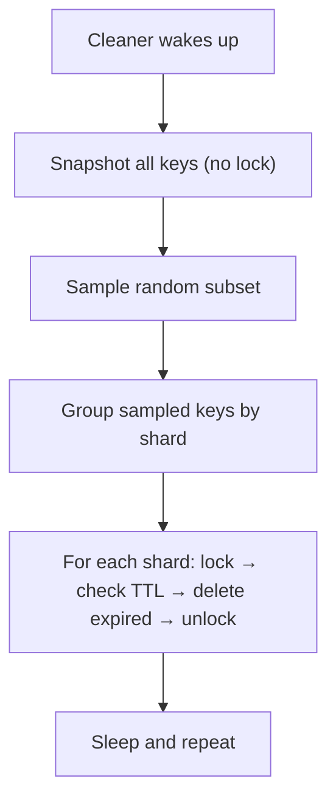

# Concurrency Model

This is where Radish diverges most from traditional in-memory databases. **Most production key-value stores are single-threaded** — they process one command at a time, which elegantly avoids all concurrency issues. **Radish is multi-threaded** — multiple clients are served concurrently, which requires explicit synchronization.

This was a deliberate choice for the didactical goal: understanding concurrency primitives is essential for systems engineering, and Radish provides a real-world context to explore them.

---

## The Problem

When multiple clients access shared state concurrently, bad things can happen:

```
Client A: reads counter = 10
Client B: reads counter = 10
Client A: writes counter = 11
Client B: writes counter = 11    ← Should be 12!
```

This is a **race condition** — the classic lost-update problem. Radish needs to prevent this while keeping throughput high.

---

## Sharded Locking

Instead of a single global lock (which would serialize everything), Radish uses **sharded locking** — 256 independent locks (configurable via [`num_shards`](configuration)). Each key is mapped to a shard using a hash:

```julia
shard_id(lock, key::String) = (hash(key) % lock.num_shards) + 1
```

With uniform key distribution, two random keys have only a 1/256 ≈ 0.4% chance of contending with each other.

### Why 256 Shards?

| Shards | Contention | Memory | Comment |
|---|---|---|---|
| 1 | Maximum — all operations serialized | Minimal | Equivalent to a global lock |
| 256 | Low — only keys on the same shard contend | Moderate | Good balance (default) |
| ∞ | Zero — per-key locking | High | Overkill for most workloads |

### Read vs Write Locks

Each shard supports concurrent readers or exclusive writers:

- **Read lock** — multiple readers can hold it simultaneously (e.g., `S_GET`, `L_LEN`)
- **Write lock** — exclusive access, no readers or other writers (e.g., `S_SET`, `L_POP`)

The [dispatcher](dispatcher) determines whether a command needs a read or write lock:

```julia
const READ_OPS = Set(["S_GET", "S_LEN", "S_GETRANGE", "S_LCS", "S_COMPLEN",
                       "L_GET", "L_LEN", "L_RANGE",
                       "SET_GET", "SET_LEN",
                       "KLIST", "EXISTS", "TYPE", "TTL", "DBSIZE"])
```

Anything not in `READ_OPS` requires a write lock.

---

## The Fair Lock (SimpleFairShardedLock)

Radish's default lock implementation is a **write-preferring, starvation-free** lock built from scratch with no external dependencies. It solves a critical problem: under mixed read/write workloads with hot keys, reader-preferring locks (like `ConcurrentUtilities.ReadWriteLock`) starve writers indefinitely — new readers keep arriving and the writer never gets a turn.

The fair lock guarantees:
- **No writer starvation** — once a writer is queued, new readers park until it finishes
- **No reader starvation** — after N consecutive writes, readers get a turn (batch drain)
- **FIFO ordering for writers** — deterministic, no priority inversion
- **No deadlocks** — tested up to 4,096 concurrent workers on a single hot key

### Per-Shard State

Each of the 256 shards maintains its own independent lock state:

<div style="background: #1e1e2e; border: 2px solid #6c7086; border-radius: 8px; padding: 20px; font-family: monospace; font-size: 13px; color: #cdd6f4; margin: 1em 0;">
<div style="text-align: center; font-weight: bold; margin-bottom: 16px; color: #89b4fa; font-size: 15px;">FairShardLock (per shard)</div>
<div style="display: grid; grid-template-columns: 1fr 1fr; gap: 12px; margin-bottom: 12px;">
  <div style="background: #313244; border: 1px solid #585b70; border-radius: 4px; padding: 8px; text-align: center;">
    <div style="color: #a6e3a1; font-weight: bold;">active_readers: 0</div>
    <div style="color: #9399b2; font-size: 11px;">Atomic{Int}</div>
  </div>
  <div style="background: #313244; border: 1px solid #585b70; border-radius: 4px; padding: 8px; text-align: center;">
    <div style="color: #f38ba8; font-weight: bold;">writer_active: 0</div>
    <div style="color: #9399b2; font-size: 11px;">Atomic{Int}</div>
  </div>
  <div style="background: #313244; border: 1px solid #585b70; border-radius: 4px; padding: 8px; text-align: center;">
    <div style="color: #a6e3a1; font-weight: bold;">waiting_readers: 0</div>
    <div style="color: #9399b2; font-size: 11px;">Atomic{Int}</div>
  </div>
  <div style="background: #313244; border: 1px solid #585b70; border-radius: 4px; padding: 8px; text-align: center;">
    <div style="color: #fab387; font-weight: bold;">writes_since_flush: 0</div>
    <div style="color: #9399b2; font-size: 11px;">plain Int</div>
  </div>
</div>
<div style="background: #313244; border: 1px solid #585b70; border-radius: 4px; padding: 8px; margin-bottom: 8px;">
  <div style="color: #cba6f7; font-weight: bold;">write_queue: [ Event_A | Event_B | Event_C ]</div>
  <div style="color: #9399b2; font-size: 11px;">FIFO Vector — writers wait on their Event</div>
</div>
<div style="background: #313244; border: 1px solid #585b70; border-radius: 4px; padding: 8px; margin-bottom: 8px;">
  <div style="color: #89dceb; font-weight: bold;">reader_cond: Threads.Condition</div>
  <div style="color: #9399b2; font-size: 11px;">All blocked readers wait here, woken together</div>
</div>
<div style="background: #313244; border: 1px solid #585b70; border-radius: 4px; padding: 8px;">
  <div style="color: #f9e2af; font-weight: bold;">mu: ReentrantLock</div>
  <div style="color: #9399b2; font-size: 11px;">Protects write_queue + writes_since_flush</div>
</div>
</div>

### How Read Acquire Works

<div style="background: #1e1e2e; border: 2px solid #6c7086; border-radius: 8px; padding: 20px; font-family: monospace; font-size: 13px; color: #cdd6f4; margin: 1em 0;">
<div style="text-align: center; color: #89b4fa; font-weight: bold; margin-bottom: 12px;">acquire_read!(lock, shard_id)</div>
<div style="text-align: center; margin-bottom: 12px;">│<br/>▼</div>
<div style="text-align: center; background: #313244; border: 1px solid #585b70; border-radius: 4px; padding: 8px; margin: 0 auto 12px; max-width: 300px;">
  <span style="color: #f9e2af;">writer_active == 0?</span>
</div>
<div style="display: grid; grid-template-columns: 1fr 1fr; gap: 16px;">
  <div style="text-align: center;">
    <div style="color: #a6e3a1; font-weight: bold; margin-bottom: 8px;">YES → Fast Path</div>
    <div style="background: #313244; border: 1px solid #a6e3a1; border-radius: 4px; padding: 8px;">
      <div>atomic_add! active_readers += 1</div>
      <div style="margin-top: 4px;">Double-check: writer still 0?</div>
      <div style="margin-top: 4px; color: #a6e3a1;">YES → <strong>DONE</strong></div>
      <div style="color: #9399b2; font-size: 11px;">NO → undo, go to slow path</div>
    </div>
    <div style="color: #9399b2; margin-top: 8px; font-size: 11px;">~40 ns (2 atomic loads + 1 add)</div>
  </div>
  <div style="text-align: center;">
    <div style="color: #f38ba8; font-weight: bold; margin-bottom: 8px;">NO → Slow Path</div>
    <div style="background: #313244; border: 1px solid #f38ba8; border-radius: 4px; padding: 8px;">
      <div>waiting_readers++</div>
      <div style="margin-top: 4px;">wait(reader_cond)</div>
      <div style="color: #9399b2; font-size: 11px; margin-top: 4px;">⏸ blocks until release_write!</div>
      <div style="margin-top: 4px;">waiting_readers--</div>
      <div style="margin-top: 4px; color: #f9e2af;">retry from top</div>
    </div>
  </div>
</div>
</div>

### How Write Acquire Works

<div style="background: #1e1e2e; border: 2px solid #6c7086; border-radius: 8px; padding: 20px; font-family: monospace; font-size: 13px; color: #cdd6f4; margin: 1em 0;">
<div style="text-align: center; color: #89b4fa; font-weight: bold; margin-bottom: 12px;">acquire_write!(lock, shard_id)</div>
<div style="text-align: center; margin-bottom: 12px;">│<br/>▼</div>
<div style="text-align: center; background: #313244; border: 1px solid #585b70; border-radius: 4px; padding: 8px; margin: 0 auto 12px; max-width: 400px;">
  <span style="color: #f9e2af;">lock(mu)<br/>writer_active == 0 AND active_readers == 0 AND write_queue empty?</span>
</div>
<div style="display: grid; grid-template-columns: 1fr 1fr; gap: 16px;">
  <div style="text-align: center;">
    <div style="color: #a6e3a1; font-weight: bold; margin-bottom: 8px;">YES → Fast Path</div>
    <div style="background: #313244; border: 1px solid #a6e3a1; border-radius: 4px; padding: 8px;">
      <div>writer_active = 1</div>
      <div style="margin-top: 4px;">unlock(mu)</div>
      <div style="margin-top: 4px; color: #a6e3a1;"><strong>DONE</strong></div>
    </div>
    <div style="color: #9399b2; margin-top: 8px; font-size: 11px;">~50 ns (mutex + 3 checks + set)</div>
  </div>
  <div style="text-align: center;">
    <div style="color: #f38ba8; font-weight: bold; margin-bottom: 8px;">NO → Enqueue (FIFO)</div>
    <div style="background: #313244; border: 1px solid #f38ba8; border-radius: 4px; padding: 8px;">
      <div>Create Event</div>
      <div style="margin-top: 4px;">push!(write_queue, event)</div>
      <div style="margin-top: 4px;">unlock(mu)</div>
      <div style="margin-top: 4px;">wait(event)</div>
      <div style="color: #9399b2; font-size: 11px; margin-top: 4px;">⏸ blocks — woken in FIFO order</div>
      <div style="margin-top: 4px; color: #a6e3a1;"><strong>DONE</strong></div>
      <div style="color: #9399b2; font-size: 11px;">(writer_active already set by whoever woke us)</div>
    </div>
  </div>
</div>
</div>

### Write Release and Batch Drain

When a writer releases the lock, it decides who goes next:

<div style="background: #1e1e2e; border: 2px solid #6c7086; border-radius: 8px; padding: 20px; font-family: monospace; font-size: 13px; color: #cdd6f4; margin: 1em 0;">
<div style="text-align: center; color: #89b4fa; font-weight: bold; margin-bottom: 12px;">release_write!(lock, shard_id)</div>
<div style="text-align: center; margin-bottom: 16px;">lock(mu), writes_since_flush += 1</div>
<div style="display: grid; grid-template-columns: 1fr 1fr 1fr; gap: 12px;">
  <div style="background: #313244; border: 2px solid #cba6f7; border-radius: 6px; padding: 12px; text-align: center;">
    <div style="color: #cba6f7; font-weight: bold; margin-bottom: 8px;">A) Next Writer</div>
    <div style="font-size: 12px; color: #9399b2; margin-bottom: 8px;">write_queue not empty<br/>AND flush &lt; N</div>
    <div style="color: #cdd6f4;">pop event from queue</div>
    <div>(writer_active stays 1)</div>
    <div>notify(event)</div>
  </div>
  <div style="background: #313244; border: 2px solid #a6e3a1; border-radius: 6px; padding: 12px; text-align: center;">
    <div style="color: #a6e3a1; font-weight: bold; margin-bottom: 8px;">B) Batch Drain</div>
    <div style="font-size: 12px; color: #9399b2; margin-bottom: 8px;">waiting_readers &gt; 0<br/>AND flush ≥ N</div>
    <div style="color: #cdd6f4;">writes_since_flush = 0</div>
    <div>writer_active = 0</div>
    <div>notify_all(reader_cond)</div>
    <div style="color: #a6e3a1; font-size: 11px; margin-top: 4px;">all readers wake up</div>
  </div>
  <div style="background: #313244; border: 2px solid #585b70; border-radius: 6px; padding: 12px; text-align: center;">
    <div style="color: #9399b2; font-weight: bold; margin-bottom: 8px;">C) Release</div>
    <div style="font-size: 12px; color: #9399b2; margin-bottom: 8px;">nobody waiting</div>
    <div style="color: #cdd6f4;">writes_since_flush = 0</div>
    <div>writer_active = 0</div>
    <div>unlock(mu)</div>
    <div style="color: #9399b2; font-size: 11px; margin-top: 4px;">shard is free</div>
  </div>
</div>
</div>

The **batch drain** mechanism prevents reader starvation. After N consecutive writes (default N=5), if readers are waiting, the lock pauses writers and lets all blocked readers proceed:

<div style="background: #1e1e2e; border: 2px solid #6c7086; border-radius: 8px; padding: 20px; font-family: monospace; font-size: 13px; color: #cdd6f4; margin: 1em 0; overflow-x: auto;">
<div style="text-align: center; color: #89b4fa; font-weight: bold; margin-bottom: 12px;">Batch Drain Timeline (N=5)</div>
<table style="width: 100%; border-collapse: collapse; font-size: 12px;">
<tr>
  <td style="color: #9399b2; padding: 4px 8px; width: 80px;">Time →</td>
  <td colspan="5" style="padding: 4px;"></td>
  <td style="padding: 4px; text-align: center; color: #a6e3a1; font-weight: bold;">DRAIN</td>
  <td colspan="3" style="padding: 4px;"></td>
</tr>
<tr>
  <td style="color: #f38ba8; padding: 4px 8px;">Writers</td>
  <td style="padding: 4px;"><span style="background: #f38ba8; color: #1e1e2e; padding: 2px 6px; border-radius: 2px;">W1</span></td>
  <td style="padding: 4px;"><span style="background: #f38ba8; color: #1e1e2e; padding: 2px 6px; border-radius: 2px;">W2</span></td>
  <td style="padding: 4px;"><span style="background: #f38ba8; color: #1e1e2e; padding: 2px 6px; border-radius: 2px;">W3</span></td>
  <td style="padding: 4px;"><span style="background: #f38ba8; color: #1e1e2e; padding: 2px 6px; border-radius: 2px;">W4</span></td>
  <td style="padding: 4px;"><span style="background: #f38ba8; color: #1e1e2e; padding: 2px 6px; border-radius: 2px;">W5</span></td>
  <td style="padding: 4px; text-align: center;">│</td>
  <td style="padding: 4px;"><span style="background: #f38ba8; color: #1e1e2e; padding: 2px 6px; border-radius: 2px;">W6</span></td>
  <td style="padding: 4px;"><span style="background: #f38ba8; color: #1e1e2e; padding: 2px 6px; border-radius: 2px;">W7</span></td>
  <td style="padding: 4px;"><span style="background: #f38ba8; color: #1e1e2e; padding: 2px 6px; border-radius: 2px;">W8</span></td>
</tr>
<tr>
  <td style="color: #a6e3a1; padding: 4px 8px;">Readers</td>
  <td colspan="5" style="padding: 4px; text-align: center;"><span style="background: #45475a; color: #9399b2; padding: 2px 12px; border-radius: 2px;">░░░ blocked ░░░</span></td>
  <td style="padding: 4px; text-align: center;"><span style="background: #a6e3a1; color: #1e1e2e; padding: 2px 6px; border-radius: 2px; font-weight: bold;">R R R</span></td>
  <td colspan="3" style="padding: 4px; text-align: center;"><span style="background: #45475a; color: #9399b2; padding: 2px 12px; border-radius: 2px;">░░░ blocked ░░░</span></td>
</tr>
<tr>
  <td style="color: #fab387; padding: 4px 8px;">Counter</td>
  <td style="padding: 4px; color: #fab387;">1</td>
  <td style="padding: 4px; color: #fab387;">2</td>
  <td style="padding: 4px; color: #fab387;">3</td>
  <td style="padding: 4px; color: #fab387;">4</td>
  <td style="padding: 4px; color: #fab387;">5</td>
  <td style="padding: 4px; text-align: center; color: #a6e3a1; font-weight: bold;">→ 0</td>
  <td style="padding: 4px; color: #fab387;">1</td>
  <td style="padding: 4px; color: #fab387;">2</td>
  <td style="padding: 4px; color: #fab387;">3</td>
</tr>
</table>
</div>

### State Transitions

<div style="background: #1e1e2e; border: 2px solid #6c7086; border-radius: 8px; padding: 20px; font-family: monospace; font-size: 13px; color: #cdd6f4; margin: 1em 0; text-align: center;">
<div style="display: inline-block; border: 2px solid #89b4fa; border-radius: 8px; padding: 12px 24px; margin-bottom: 16px;">
  <div style="color: #89b4fa; font-weight: bold;">FREE</div>
  <div style="font-size: 11px; color: #9399b2;">writer_active=0, active_readers=0</div>
</div>
<div style="margin-bottom: 16px;">
  <span style="color: #a6e3a1;">read acquire ↙</span>
  &nbsp;&nbsp;&nbsp;&nbsp;&nbsp;&nbsp;&nbsp;
  <span style="color: #f38ba8;">↘ write acquire</span>
</div>
<div style="display: grid; grid-template-columns: 1fr 1fr; gap: 24px; max-width: 500px; margin: 0 auto;">
  <div style="border: 2px solid #a6e3a1; border-radius: 8px; padding: 12px;">
    <div style="color: #a6e3a1; font-weight: bold;">READING</div>
    <div style="font-size: 11px; color: #9399b2;">writer_act=0, active_r &gt; 0</div>
    <div style="margin-top: 8px; font-size: 11px; color: #cdd6f4;">last reader releases →<br/>FREE or wake queued writer</div>
  </div>
  <div style="border: 2px solid #f38ba8; border-radius: 8px; padding: 12px;">
    <div style="color: #f38ba8; font-weight: bold;">WRITING</div>
    <div style="font-size: 11px; color: #9399b2;">writer_act=1, active_r=0</div>
    <div style="margin-top: 8px; font-size: 11px; color: #cdd6f4;">release → NEXT WRITER<br/>or BATCH DRAIN<br/>or FREE</div>
  </div>
</div>
<div style="margin-top: 16px; border: 2px solid #a6e3a1; border-radius: 8px; padding: 8px; display: inline-block; background: #313244;">
  <div style="color: #a6e3a1; font-weight: bold; font-size: 12px;">BATCH DRAIN</div>
  <div style="font-size: 11px; color: #9399b2;">after N writes + readers waiting → wake all readers → READING</div>
</div>
</div>

### Performance Characteristics

| Scenario | Latency |
|----------|---------|
| Uncontended read acquire | ~40 ns |
| Uncontended write acquire | ~50 ns |
| Read release (other readers remain) | ~5 ns |
| Read release (last reader, no writers queued) | ~10 ns |
| Read release (last reader, writer queued) | ~100 ns |

### Integration in Radish

<div style="background: #1e1e2e; border: 2px solid #6c7086; border-radius: 8px; padding: 20px; font-family: monospace; font-size: 13px; color: #cdd6f4; margin: 1em 0;">
<div style="text-align: center; color: #89b4fa; font-weight: bold; margin-bottom: 16px; font-size: 15px;">handle_client</div>
<div style="display: grid; grid-template-columns: 1fr 1fr; gap: 16px; margin-bottom: 16px;">
  <div style="text-align: center;">
    <div style="background: #313244; border: 1px solid #585b70; border-radius: 4px; padding: 8px;">
      <div style="color: #cdd6f4;">single cmd</div>
      <div style="margin-top: 4px;">↓</div>
      <div style="color: #89b4fa; font-weight: bold;">execute!</div>
    </div>
  </div>
  <div style="text-align: center;">
    <div style="background: #313244; border: 1px solid #585b70; border-radius: 4px; padding: 8px;">
      <div style="color: #cdd6f4;">batch (pipeline)</div>
      <div style="margin-top: 4px;">↓</div>
      <div style="color: #89b4fa; font-weight: bold;">execute_batch!</div>
    </div>
  </div>
</div>
<div style="text-align: center; margin-bottom: 8px;">↓ &nbsp;&nbsp;&nbsp;&nbsp;&nbsp;&nbsp;&nbsp;&nbsp;&nbsp;&nbsp;&nbsp;&nbsp;&nbsp;&nbsp;&nbsp;&nbsp;&nbsp;&nbsp;&nbsp;&nbsp;&nbsp;&nbsp;&nbsp;&nbsp;&nbsp;&nbsp;&nbsp; ↓</div>
<div style="background: #313244; border: 2px solid #a6e3a1; border-radius: 8px; padding: 16px; margin-bottom: 16px;">
  <div style="text-align: center; color: #a6e3a1; font-weight: bold; margin-bottom: 8px;">FairShardedLock</div>
  <div style="display: grid; grid-template-columns: 1fr 1fr; gap: 8px; font-size: 12px;">
    <div style="color: #cdd6f4;">acquire_read!(lock, shard_id)</div>
    <div style="color: #cdd6f4;">release_read!(lock, shard_id)</div>
    <div style="color: #cdd6f4;">acquire_write!(lock, shard_id)</div>
    <div style="color: #cdd6f4;">release_write!(lock, shard_id)</div>
    <div style="color: #9399b2;">acquire_all_read!(lock) ← KLIST</div>
    <div style="color: #9399b2;">acquire_all_write!(lock) ← FLUSHDB</div>
  </div>
</div>
<div style="background: #313244; border: 1px solid #585b70; border-radius: 4px; padding: 8px; font-size: 12px;">
  <div style="color: #9399b2; margin-bottom: 4px;">Background tasks (on separate threads via @spawn):</div>
  <div style="color: #cdd6f4;">• cleaner: read-lock scan → release → write-lock delete</div>
  <div style="color: #cdd6f4;">• syncer: read-lock affected shards → snapshot</div>
</div>
</div>

{: .note }
> A standard reader-preferring lock (`ConcurrentUtilities.ReadWriteLock`) is also available via `lock_type: "standard"` in `radish.yml`. It's faster under low contention (~25ns) but starves writers when 4+ clients hit the same key with mixed reads and writes — use it only for read-heavy workloads with no hot keys.

---

## Ordered Lock Acquisition

When multiple locks are needed (multi-key operations or transactions), locks must be acquired in a **consistent order** to prevent deadlocks:

```julia
function acquire_write!(lock::ShardedLock, key_list::Vector{String})
    shard_ids = unique(sort([shard_id(lock, k) for k in key_list]))
    for id in shard_ids
        Base.lock(lock.shards[id])
    end
    return shard_ids
end
```

And released in **reverse order**:

```julia
function release_write!(lock::ShardedLock, shard_ids::Vector)
    for id in reverse(shard_ids)
        Base.unlock(lock.shards[id])
    end
end
```

This `sort → lock → unlock in reverse` pattern is a standard technique for deadlock prevention.

---

## Global Operations

Some commands need access to all keys (e.g., `KLIST`, `FLUSHDB`). These acquire **all shard locks**:

```julia
function acquire_all_read!(lock::ShardedLock)
    for i in 1:lock.num_shards
        readlock(lock.shards[i])
    end
    return collect(1:lock.num_shards)
end
```

This is expensive but rare — and it's still better than a single global lock because read-only global operations (`KLIST`) use read locks, allowing other read operations to proceed.

---

## Background Tasks

Radish runs three background tasks using `Threads.@spawn` (each on its own OS thread):

### Async Cleaner (TTL Expiry)

Radish uses a **lazy + probabilistic** approach to TTL expiry:
- **Lazy**: check on access (if a key is read and it's expired, delete it)
- **Probabilistic**: periodically sample random keys and delete expired ones

Radish implements both. The lazy check happens inside hypercommands (every `rget_or_expire!` checks TTL). The background cleaner handles keys that nobody reads:


```mermaid
graph TD
    A["Cleaner wakes up"] --> B["Snapshot all keys (no lock)"]
    B --> C["Sample random subset"]
    C --> D["Group sampled keys by shard"]
    D --> E["For each shard: lock → check TTL → delete expired → unlock"]
    E --> F["Sleep and repeat"]
```

The cleaner uses **per-shard locking** — it locks one shard at a time, checks only the sampled keys in that shard, and moves on. This minimizes the time any single shard is locked.

### Async Syncer (Persistence)

See the [Persistence](persistence) page for details. The syncer runs at a [configurable interval](configuration) (default: every 5 seconds), pops dirty changes, and writes them to shard-specific RDB files.

### AOF Flusher

When `aof_sync_ms > 0` (default: 1000ms), a third background task periodically flushes the AOF IOStream to disk. This batches fsync calls for better throughput while bounding the data-loss window.

---

## Batch Execution (Pipelining)

When a client pipelines multiple commands (sends them without waiting for responses), the server detects buffered data and uses a **batch execution path**:

1. All commands are parsed from the read buffer.
2. Lock plans are pre-computed and merged — one combined lock acquisition instead of per-command acquire/release.
3. Write shards subsume read shards on the same shard (write > read).
4. All locks are acquired in sorted shard order (deadlock-free).
5. AOF is written inside the lock critical section (guarantees AOF order == execution order).
6. All commands execute under the combined lock.
7. All responses are written in a single `write()` syscall.

This optimization (OPTIM 3.2b) gives 2-7x throughput improvement for pipelined clients. Batch sizes of 50-500 commands give the best results.

---

## Graceful Shutdown

When the server receives SIGINT (Ctrl+C) or SIGTERM (Docker stop), it performs a structured shutdown:

1. **Close the listening socket** — stop accepting new connections.
2. **Set the SHUTDOWN flag** — background tasks check this each cycle and exit.
3. **Wait for background tasks** to finish their current cycle.
4. **Acquire all write locks** — blocks until all client handlers release their locks.
5. **Save final snapshot** under exclusive lock — no concurrent access possible.
6. **Close and delete AOF** — snapshot is complete, AOF is redundant.

This ensures no data corruption from concurrent access during the final snapshot.
