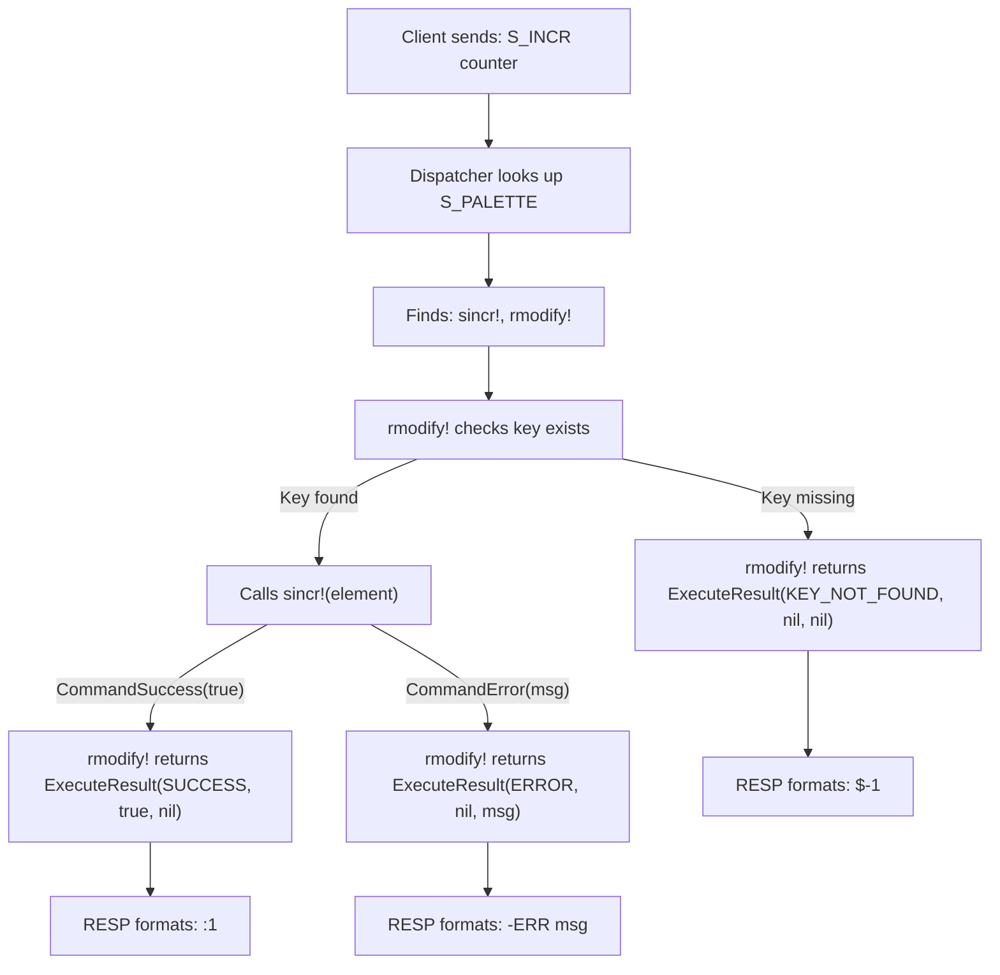

# Data Contracts

Radish enforces **strict data contracts** at two levels: the low-level *command* functions (type-specific operations) and the high-level *hypercommands* (generic operations on the context). These contracts make the system predictable, composable, and easy to debug.

---

## Command-Level Contracts

Every type command (e.g., `sget`, `sincr!`, `lpop!`) returns a `CommandResult`:

```julia
struct CommandResult
    success::Bool
    value::Any                              # Result value (string, int, tuple, etc.)
    error::Union{Nothing, String}           # Error message if success=false
    element::Union{RadishElement, Nothing}  # Only for creators (sadd, ladd!)
end
```

There are three convenience constructors that make the intent explicit:

```julia
CommandSuccess(value)           # Operation succeeded, return value
CommandError(msg::String)       # Operation failed, return error message
CommandCreate(elem)             # New element created (for add commands)
```

### The Three Patterns

All type commands fall into one of three categories:

#### 1. Readers — Return a value

```julia
function sget(elem::RadishElement, args...)
    return CommandSuccess(elem.value)
end

function slen(elem::RadishElement)
    return CommandSuccess(length(elem.value))
end

function llen(elem::RadishElement)
    return CommandSuccess(elem.value.len)
end
```

**Contract**: Always return `CommandSuccess(value)`. The value can be a `String`, `Int`, `Tuple`, `Vector`, or `Bool`.

#### 2. Mutators — Modify and return status

```julia
function sincr!(elem::RadishElement)
    elem_n = tryparse(Int, string(elem.value))
    if isa(elem_n, Nothing)
        return CommandError("Value '$(elem.value)' is not an integer")
    end
    elem_n += 1
    elem.value = string(elem_n)
    return CommandSuccess(true)
end

function sappend!(elem::RadishElement, value::AbstractString)
    elem.value = elem.value * value
    return CommandSuccess(true)
end
```

**Contract**: Return `CommandSuccess(true)` on success, or `CommandError(msg)` if validation fails. The element is modified **in place** — the mutation happens on the `RadishElement` fields directly.

{: .note }
> Some mutators return a value instead of `true`. For example, `sgincr!` (get-then-increment) returns the value *before* mutation: `CommandSuccess(original_value)`.

#### 3. Creators — Construct a new element

```julia
function sadd(value::AbstractString, ttl::AbstractString)
    ttl_p = tryparse(Int, ttl)
    if isa(ttl_p, Nothing)
        return CommandError("TTL must be a valid integer, got '$ttl'")
    end
    elem = RadishElement(value, ttl_p, now(), :string)
    return CommandCreate(elem)
end

function sadd(value::AbstractString)
    elem = RadishElement(value, nothing, now(), :string)
    return CommandCreate(elem)
end
```

**Contract**: Return `CommandCreate(elem)` with the newly constructed `RadishElement`, or `CommandError(msg)` if input validation fails. Creators **never** receive an existing element — they receive raw arguments.

---

## Hypercommand-Level Contracts

Hypercommands translate `CommandResult` into `ExecuteResult`:

```julia
struct ExecuteResult
    status::ExecutionStatus     # SUCCESS, KEY_NOT_FOUND, or ERROR
    value::Any                  # The result to send to the client
    error::Union{Nothing, String}
end

@enum ExecutionStatus begin
    SUCCESS          # Command executed successfully
    KEY_NOT_FOUND    # Key doesn't exist or expired
    ERROR            # Wrong type, bad args, exception
end
```

### Translation Rules

Each hypercommand follows a consistent pattern for mapping `CommandResult` → `ExecuteResult`:

| Hypercommand | On key found + success | On key found + failure | On key missing |
|---|---|---|---|
| `rget_or_expire!` | `SUCCESS(value)` | `ERROR(msg)` | `KEY_NOT_FOUND` |
| `rget_on_modify_or_expire!` | `SUCCESS(value)` + mark dirty | `ERROR(msg)` | `KEY_NOT_FOUND` |
| `radd!` | N/A (key must not exist) | `ERROR(msg)` | `SUCCESS(true)` + create |
| `radd_or_modify!` | Delegates to `rmodify!` | — | Delegates to `radd!` |
| `rmodify!` | `SUCCESS(value)` + mark dirty | `ERROR(msg)` | `KEY_NOT_FOUND` |
| `rdelete!` | `true` | — | `false` |
| `relement_to_element` | `SUCCESS(value)` | `ERROR(msg)` | `KEY_NOT_FOUND` |
| `relement_to_element_consume_key2!` | `SUCCESS(value)` + delete key2 | `ERROR(msg)` | `KEY_NOT_FOUND` |

### TTL Checking

Every hypercommand that reads a key checks the TTL first:

```julia
if element.ttl !== nothing && now() > element.tinit + Second(element.ttl)
    delete!(context, key)
    if tracker !== nothing
        mark_deleted!(tracker, key)
    end
    return ExecuteResult(KEY_NOT_FOUND, nothing, nothing)
end
```

If a key has expired, it is **deleted on access** (lazy expiry) and treated as if it never existed. This is the same strategy Redis uses.

### Auto-Delete Hypercommands

Two additional hypercommands handle cleanup of structurally empty data structures:

| Hypercommand | Behavior |
|---|---|
| `rget_on_modify_or_expire_autodelete!` | After modifying, check if element is empty → auto-delete |
| `rmodify_autodelete!` | After modifying, check if element is empty → auto-delete |

These are used for operations like `L_POP` and `L_TRIM` where the list might become empty. The check delegates to type-specific `is_empty` functions using Julia's multiple dispatch:

```julia
function check_empty(elem::RadishElement)::Bool
    return is_empty(Val(elem.datatype), elem)
end

# Strings are never structurally empty
function is_empty(::Val{:string}, elem::RadishElement)::Bool
    return false
end

# Lists are empty when they have no nodes
function is_empty(::Val{:list}, elem::RadishElement)::Bool
    return elem.value.len == 0
end
```

---

## How `radd!` Differs From Other Hypercommands

Notice that `radd!` has a **reversed** key-existence contract compared to the others:

- Most hypercommands: key must **exist** → call command → return result
- `radd!`: key must **not exist** → call creator → store new element

```julia
function radd!(context, key, command, args...; tracker=nothing)
    if haskey(context, key)
        return ExecuteResult(ERROR, nothing, "Key '$key' already exists")
    end
    cmd_result = command(args...)  # Creator: no existing element passed
    context[key] = cmd_result.element
    return ExecuteResult(SUCCESS, true, nothing)
end
```

The creator function receives the raw arguments (value, TTL), not an existing element. This asymmetry is intentional — it separates **creation logic** from **modification logic**, keeping each command function focused on one concern.

---

## The Complete Contract Flow

Here's how the contracts compose end-to-end:



This layered design — **type command → hypercommand → dispatcher → RESP formatter** — means each layer has a clear, well-defined contract with the next.
