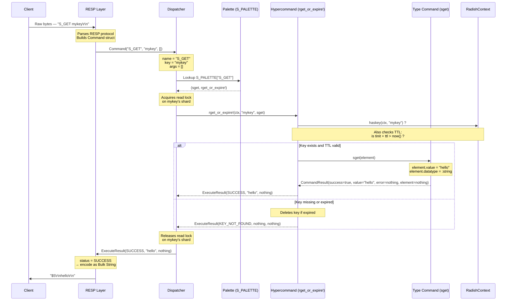

# Data Contracts

Radish uses a layered system of structs to represent commands, their execution, and results. Understanding these contracts is crucial to understanding how data flows through the system.

---

## The Four Core Structs

### 1. Command — The Client Request

```julia
struct Command
    name::String                    # Command name (e.g., "S_GET", "L_POP")
    key::Union{Nothing, String}     # Target key, or nothing for keyless commands
    args::Vector{String}            # Additional arguments
end
```

**Purpose:** Represents a parsed client request after RESP decoding.

**Created by:** The RESP protocol layer (`read_resp_command` in `resp.jl`)

**Examples:**
```julia
Command("S_GET", "mykey", [])                    # S_GET mykey
Command("S_SET", "mykey", ["hello", "60"])       # S_SET mykey hello 60
Command("L_RANGE", "mylist", ["1", "10"])        # L_RANGE mylist 1 10
Command("PING", nothing, [])                     # PING (no key)
```

**Flow:** Client → RESP decoder → `Command` → Dispatcher

---

### 2. CommandResult — Type Command Output

```julia
struct CommandResult
    success::Bool                              # Did the operation succeed?
    value::Any                                 # Result value (for reads/modifications)
    error::Union{Nothing, String}              # Error message if success=false
    element::Union{RadishElement, Nothing}     # New element (for creators only)
end
```

**Purpose:** Returned by **type commands** (like `sget`, `sincr!`, `lpop!`) to indicate success or failure at the data structure level.

**Created by:** Type commands in `rstrings.jl`, `rlinkedlists.jl`

**Convenience constructors:**
```julia
CommandSuccess(value)           # Success with a return value
CommandError(msg::String)       # Failure with error message
CommandCreate(elem::RadishElement)  # Success, created new element
```

**Examples:**
```julia
# String get operation
CommandSuccess("hello")

# Increment operation
CommandSuccess(true)

# Create new string
CommandCreate(RadishElement("world", nothing, now(), :string))

# Error: value is not an integer
CommandError("Value 'abc' is not an integer")
```

**Flow:** Type command → `CommandResult` → Hypercommand

---

### 3. ExecuteResult — Hypercommand Output

```julia
struct ExecuteResult
    status::ExecutionStatus                # SUCCESS, KEY_NOT_FOUND, or ERROR
    value::Any                             # Result to return to client
    error::Union{Nothing, String}          # Error message (only for ERROR status)
end
```

**Purpose:** Returned by **hypercommands** (like `rget_or_expire!`, `radd!`) after handling TTL checks, key lookup, and delegation to type commands.

**Created by:** Hypercommands in `radishelem.jl`

**Status enum:**
```julia
@enum ExecutionStatus begin
    SUCCESS          # Command executed successfully
    KEY_NOT_FOUND    # Key doesn't exist or expired
    ERROR            # Wrong command, wrong type, bad arguments
end
```

**Examples:**
```julia
# Successful read
ExecuteResult(SUCCESS, "hello", nothing)

# Key not found or expired
ExecuteResult(KEY_NOT_FOUND, nothing, nothing)

# Type mismatch error
ExecuteResult(ERROR, nothing, "WRONGTYPE: Key 'mykey' holds a list, not a string")
```

**Flow:** Hypercommand → `ExecuteResult` → Dispatcher → RESP encoder

---

### 4. ExecutionStatus — The Final Verdict

```julia
@enum ExecutionStatus begin
    SUCCESS          # Command executed, value returned
    KEY_NOT_FOUND    # Key doesn't exist or expired
    ERROR            # Wrong type, bad arguments, etc.
end
```

**Purpose:** A simple enum to categorize the outcome of a command execution.

**Used by:** `ExecuteResult` to indicate the high-level status

**Mapping to RESP responses:**

| ExecutionStatus | RESP Response | Example |
|---|---|---|
| `SUCCESS` | `+OK`, `:integer`, `$bulk`, `*array` | `+OK\r\n`, `:42\r\n`, `$5\r\nhello\r\n` |
| `KEY_NOT_FOUND` | `$-1\r\n` (nil) | Client sees `(nil)` |
| `ERROR` | `-ERR message\r\n` | `-ERR WRONGTYPE ...\r\n` |

---

## The Complete Flow

Here's how these structs interact during a command execution: (I know this chart is a bit hard to see, please zoom in, this is not a static image I promise you will see the details after zooming)



---

## Conversion Rules

### CommandResult → ExecuteResult

Hypercommands convert `CommandResult` to `ExecuteResult`:

```julia
cmd_result = command(element, args...)

if !cmd_result.success
    return ExecuteResult(ERROR, nothing, cmd_result.error)
end

return ExecuteResult(SUCCESS, cmd_result.value, nothing)
```

**Key insight:** `CommandResult.success=false` always becomes `ExecuteResult(ERROR, ...)`

### ExecuteResult → RESP

The RESP encoder (`write_resp_response` in `resp.jl`) converts `ExecuteResult` to wire format:

```julia
if result.status == ERROR
    write(sock, "-ERR $(result.error)\r\n")
elseif result.status == KEY_NOT_FOUND
    write(sock, "$-1\r\n")  # nil
elseif result.status == SUCCESS
    # Format based on value type (string, integer, array, etc.)
end
```

---

## Why This Layered Design?

1. **Separation of concerns:**
   - Type commands focus on data structure logic
   - Hypercommands handle cross-cutting concerns (TTL, key lookup)
   - Dispatcher handles routing and locking
   - RESP layer handles wire protocol

2. **Type safety:**
   - `CommandResult` is internal (type command ↔ hypercommand)
   - `ExecuteResult` is the public contract (hypercommand ↔ dispatcher ↔ client)

3. **Extensibility:**
   - Adding a new data type only requires implementing type commands that return `CommandResult`
   - The rest of the system (hypercommands, dispatcher, RESP) remains unchanged

4. **Error propagation:**
   - Type-level errors (e.g., "value is not an integer") flow through `CommandResult.error`
   - System-level errors (e.g., "key not found") are handled by hypercommands
   - Both eventually become `ExecuteResult` for the client

---

## Common Patterns

### Pattern 1: Read Operation

```julia
# Type command (rstrings.jl)
function sget(elem::RadishElement)
    return CommandSuccess(elem.value)
end

# Hypercommand (radishelem.jl)
function rget_or_expire!(context, key, command, args...)
    if haskey(context, key)
        element = context[key]
        # TTL check...
        cmd_result = command(element, args...)
        return ExecuteResult(SUCCESS, cmd_result.value, nothing)
    end
    return ExecuteResult(KEY_NOT_FOUND, nothing, nothing)
end
```

### Pattern 2: Write Operation with Validation

```julia
# Type command (rstrings.jl)
function sincr!(elem::RadishElement)
    elem_n = tryparse(Int, string(elem.value))
    if elem_n === nothing
        return CommandError("Value '$(elem.value)' is not an integer")
    end
    elem_n += 1
    elem.value = string(elem_n)
    return CommandSuccess(true)
end

# Hypercommand (radishelem.jl)
function rmodify!(context, key, command, args...)
    if haskey(context, key)
        cmd_result = command(context[key], args...)
        if !cmd_result.success
            return ExecuteResult(ERROR, nothing, cmd_result.error)
        end
        return ExecuteResult(SUCCESS, cmd_result.value, nothing)
    end
    return ExecuteResult(KEY_NOT_FOUND, nothing, nothing)
end
```

### Pattern 3: Creator Operation

```julia
# Type command (rstrings.jl)
function sadd(value::String, ttl::String)
    ttl_p = tryparse(Int, ttl)
    if ttl_p === nothing
        return CommandError("TTL must be a valid integer")
    end
    elem = RadishElement(value, ttl_p, now(), :string)
    return CommandCreate(elem)
end

# Hypercommand (radishelem.jl)
function radd!(context, key, command, args...)
    if haskey(context, key)
        return ExecuteResult(ERROR, nothing, "Key '$key' already exists")
    end
    cmd_result = command(args...)
    if !cmd_result.success
        return ExecuteResult(ERROR, nothing, cmd_result.error)
    end
    context[key] = cmd_result.element
    return ExecuteResult(SUCCESS, true, nothing)
end
```

---

## Summary Table

| Struct | Created By | Used By | Purpose |
|---|---|---|---|
| `Command` | RESP decoder | Dispatcher | Parsed client request |
| `CommandResult` | Type commands | Hypercommands | Type-level operation result |
| `ExecuteResult` | Hypercommands | Dispatcher, RESP encoder | System-level execution result |
| `ExecutionStatus` | Hypercommands | RESP encoder | High-level status category |

**The golden rule:** Type commands return `CommandResult`, hypercommands return `ExecuteResult`, and the dispatcher routes everything.
