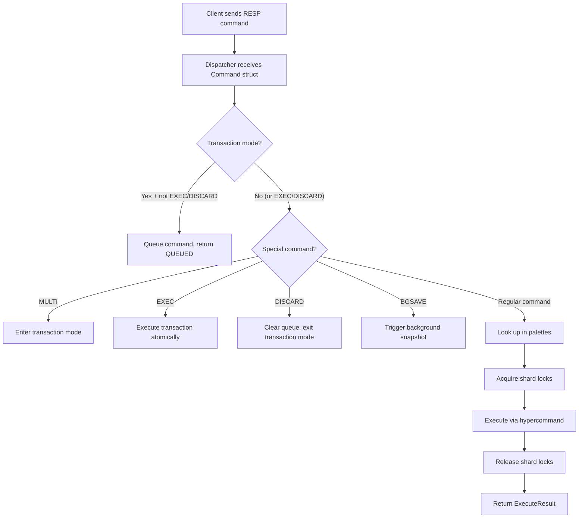

# The Dispatcher

The dispatcher is the **central router** of Radish — it receives every command from every client and decides what to do with it. It handles command parsing, lock acquisition, palette lookup, type validation, transaction management, and error handling.

Think of it as the traffic controller between the [RESP protocol layer](resp-protocol) and the [hypercommand layer](architecture).

---

## Command Lifecycle

Every command goes through these steps:



---

## Palette Lookup

The dispatcher checks four palettes in order:

```julia
# 1. No-key commands (PING, KLIST, DBSIZE, FLUSHDB, DUMP)
NOKEY_PALETTE = Dict{String, Function}(...)

# 2. String commands (S_GET, S_SET, S_INCR, ...)
S_PALETTE = Dict{String, Tuple}(...)

# 3. Linked list commands (L_ADD, L_POP, L_APPEND, ...)
LL_PALETTE = Dict{String, Tuple}(...)

# 4. Meta commands (EXISTS, DEL, TYPE, TTL, PERSIST, EXPIRE)
META_PALETTE = Dict{String, Function}(...)
```

The `NOKEY_PALETTE` maps directly to functions (no key needed). The `S_PALETTE` and `LL_PALETTE` map to `(type_command, hypercommand)` tuples — the [delegation pattern](architecture). The `META_PALETTE` maps to functions that work on any key type.

### Adding a New Command

To add a command like `S_REVERSE`:

1. Write the type command in `rstrings.jl`:
   ```julia
   function sreverse!(elem::RadishElement)
       elem.value = reverse(elem.value)
       return CommandSuccess(true)
   end
   ```

2. Add it to the palette:
   ```julia
   "S_REVERSE" => (sreverse!, rmodify!)
   ```

That's it — the dispatcher, locking, RESP encoding, and type validation all work automatically.

---

## Lock Acquisition Strategy

The dispatcher determines the lock type based on the command:

```julia
const READ_OPS = Set(["S_GET", "S_LEN", "S_GETRANGE", "L_GET",
                       "L_LEN", "L_RANGE", "KLIST", "EXISTS",
                       "TYPE", "TTL", "DBSIZE"])

const MULTI_KEY_OPS = Set(["S_LCS", "S_COMPLEN", "L_MOVE", "RENAME"])
```

| Command Type | Lock Strategy |
|---|---|
| Read operations | Read lock on key's shard |
| Write operations | Write lock on key's shard |
| Multi-key operations | Write locks on both keys' shards (sorted) |
| `KLIST` | Read locks on all 256 shards |
| `FLUSHDB` | Write locks on all 256 shards |
| `PING`, `DUMP` | No locks needed |

Locks are always released in the `finally` block, ensuring cleanup even on exceptions.

---

## Type Validation

Before executing a string command on an existing key, the dispatcher checks the key's type:

```julia
if haskey(ctx, cmd_key) && ctx[cmd_key].datatype != :string
    return ExecuteResult(false, nothing,
        "WRONGTYPE: Key '$(cmd_key)' holds a $(ctx[cmd_key].datatype), not a string")
end
```

The same check applies for list commands (`:list`). This prevents operations like `S_INCR` on a list key — the error is returned immediately without calling the hypercommand.

{: .note }
> Redis returns `WRONGTYPE Operation against a key holding the wrong kind of value` — Radish follows the same pattern with a more descriptive message.

---

## The `execute!` Function

The main entry point is `execute!`, which handles the full lifecycle:

```julia
function execute!(ctx::RadishContext, db_lock::ShardedLock,
                  cmd::Command, session::ClientSession;
                  tracker::Union{DirtyTracker, Nothing}=nothing)
    # 1. Transaction handling (MULTI/EXEC/DISCARD/QUEUING)
    # 2. Special commands (BGSAVE)
    # 3. Unknown command detection
    # 4. Lock acquisition (read/write, single/multi-key)
    # 5. Palette dispatch
    # 6. Lock release (in finally block)
end
```

### The `execute_unlocked!` Variant

During transaction execution, all locks are already held. The dispatcher provides `execute_unlocked!` — a version that skips lock acquisition:

```julia
function execute_unlocked!(ctx::RadishContext, cmd::Command;
                           tracker::Union{DirtyTracker, Nothing}=nothing)
    # Same dispatch logic as execute!, but no locking
end
```

This is called in a loop by `execute_transaction!`, which handles the lock acquisition once for all commands in the transaction.

---

## Error Handling

The dispatcher uses a layered error strategy:

| Error Source | Handling |
|---|---|
| Unknown command | `ExecuteResult(ERROR, nothing, "Unknown command: ...")` |
| Missing key argument | `ExecuteResult(ERROR, nothing, "Command X requires a key")` |
| Type mismatch | `ExecuteResult(ERROR, nothing, "WRONGTYPE: ...")` |
| Command logic error | Propagated from `CommandError` via hypercommand |
| Unexpected exception | Caught in `try/catch`, returned as `ExecuteResult(ERROR, ...)` |

All errors eventually reach the RESP layer, which formats them as `-ERR message\r\n` for the client.
