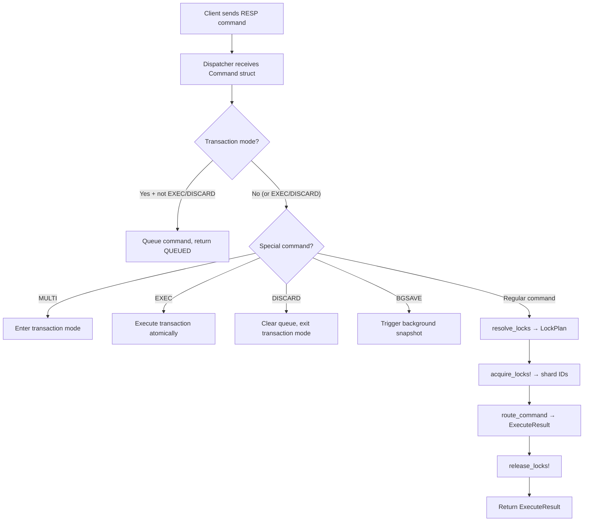

# The Dispatcher

The dispatcher is the **central router** of Radish — it receives every command from every client and decides what to do with it. Its responsibilities are split across three focused functions:

- **`execute!`** — transaction lifecycle (MULTI/EXEC/DISCARD/BGSAVE), lock orchestration, and delegation to the other two functions
- **`resolve_locks`** — determines what locks a command needs, returning a `LockPlan` (pure function, no side effects)
- **`route_command`** — palette lookup, key validation, type validation, and dispatch to hypercommands (pure function, no locking)

Think of it as the traffic controller between the [RESP protocol layer](resp-protocol) and the [hypercommand layer](architecture).

---

## Command Lifecycle

Every command goes through these steps:


```mermaid
graph TD
    A["Client sends RESP command"] --> B["Dispatcher receives Command struct"]
    B --> C{Transaction mode?}
    C -->|"Yes + not EXEC/DISCARD"| D["Queue command, return QUEUED"]
    C -->|"No (or EXEC/DISCARD)"| E{Special command?}
    E -->|"MULTI"| F["Enter transaction mode"]
    E -->|"EXEC"| G["Execute transaction atomically"]
    E -->|"DISCARD"| H["Clear queue, exit transaction mode"]
    E -->|"BGSAVE"| I["Trigger background snapshot"]
    E -->|"Regular command"| J["resolve_locks → LockPlan"]
    J --> K["acquire_locks! → shard IDs"]
    K --> L["route_command → ExecuteResult"]
    L --> M["release_locks!"]
    M --> N["Return ExecuteResult"]
```

---

## The Three Functions

### `route_command` — Pure Routing

This is the single source of truth for "given a command, what do I do with it?" It checks palettes in order:

1. **NOKEY_PALETTE** — keyless commands (`PING`, `KLIST`, `DBSIZE`, `FLUSHDB`, etc.)
2. **META_PALETTE** — type-agnostic key commands (`EXISTS`, `DEL`, `TYPE`, `TTL`, `PERSIST`, `EXPIRE`, `RENAME`)
3. **TYPE_PALETTES** — type-specific commands, iterated from a registry

```julia
# Type palettes — each entry is (datatype_symbol, palette_dict)
# To add a new data type, just append to this list.
const TYPE_PALETTES = [
    (:string, S_PALETTE),
    (:list,   LL_PALETTE),
    # (:hash, H_PALETTE),  # ← future
]
```

For type palette commands, `route_command` validates that the existing key's datatype matches the palette's expected type before dispatching. This produces the `WRONGTYPE` error when, for example, a string command is used on a list key.

Both normal execution and transaction execution call `route_command` — there is no duplicated routing logic.

### `resolve_locks` — Lock Planning

A pure function that looks at a command's name, key, and arguments and returns a `LockPlan`:

```julia
struct LockPlan
    mode::Symbol         # :none, :read, :write
    scope::Symbol        # :none, :single, :multi, :all
    key1::Union{String, Nothing}    # first key (single + multi)
    key2::Union{String, Nothing}    # second key (multi only)
end
```

The lock strategy is determined by the command type:

| Command Type | mode | scope | Example |
|---|---|---|---|
| `PING`, `QUIT`, `DBSIZE` | `:none` | `:none` | No lock needed |
| `S_GET`, `L_LEN`, `EXISTS`, `TYPE`, `TTL` | `:read` | `:single` | Read lock on key's shard |
| `S_SET`, `S_INCR`, `DEL`, `PERSIST`, `EXPIRE` | `:write` | `:single` | Write lock on key's shard |
| `S_LCS`, `S_COMPLEN` | `:read` | `:multi` | Read locks on both keys' shards |
| `L_MOVE`, `RENAME` | `:write` | `:multi` | Write locks on both keys' shards |
| `KLIST` | `:read` | `:all` | Read locks on all shards |
| `FLUSHDB` | `:write` | `:all` | Write locks on all shards |

Two helper functions translate the plan into actual lock operations:

- **`acquire_locks!(db_lock, plan)`** — acquires the right locks and returns shard IDs
- **`release_locks!(db_lock, plan, shard_ids)`** — releases locks using the plan's mode (no re-derivation needed)

### `execute!` — Orchestrator

The main entry point is a thin orchestrator that handles:

1. Transaction lifecycle (MULTI, EXEC, DISCARD) — no locks needed
2. BGSAVE — triggers async snapshot
3. Transaction queuing — validates command exists, queues it
4. Normal execution — calls `resolve_locks` → `acquire_locks!` → `route_command` → `release_locks!`

```julia
function execute!(ctx, db_lock, cmd, session; tracker=nothing)
    # 1-3: Transaction lifecycle, BGSAVE, queuing (unchanged)
    # ...

    # 4: Normal execution
    plan = resolve_locks(cmd)
    shard_ids = acquire_locks!(db_lock, plan)
    try
        return route_command(ctx, cmd; tracker=tracker)
    finally
        release_locks!(db_lock, plan, shard_ids)
    end
end
```

---

## Palette Lookup

The dispatcher checks palettes in this order:

1. `NOKEY_PALETTE` — keyless server commands
2. `META_PALETTE` — type-agnostic key commands (format: `(function, num_extra_args)`)
3. `TYPE_PALETTES` — type-specific commands via the registry loop

See [Command Palettes](palettes) for the full reference.

---

## Type Validation

Type validation happens inside `route_command` when iterating over `TYPE_PALETTES`. For each type palette, if the command is found and the key already exists, the dispatcher checks that the key's datatype matches:

```julia
for (expected_type, palette) in TYPE_PALETTES
    if cmd_name in keys(palette)
        if haskey(ctx, cmd_key) && ctx[cmd_key].datatype != expected_type
            return ExecuteResult(ERROR, nothing,
                "WRONGTYPE: Key '$(cmd_key)' holds a $(ctx[cmd_key].datatype), not a $(expected_type)")
        end
        # ... dispatch to hypercommand
    end
end
```

This means adding a new data type automatically gets type validation — no extra code needed.

{: .note }
> Redis returns `WRONGTYPE Operation against a key holding the wrong kind of value` — Radish follows the same pattern, including the key name and its actual type in the message.

---

## Error Handling

The dispatcher uses a layered error strategy:

| Error Source | Handling |
|---|---|
| Unknown command | `ExecuteResult(ERROR, nothing, "Unknown command: ...")` |
| Missing key argument | `ExecuteResult(ERROR, nothing, "Command X requires a key")` |
| Missing extra argument | `ExecuteResult(ERROR, nothing, "Command X requires an argument")` |
| Type mismatch | `ExecuteResult(ERROR, nothing, "WRONGTYPE: ...")` |
| Command logic error | Propagated from `CommandError` via hypercommand |
| Unexpected exception | Caught in `try/catch`, returned as `ExecuteResult(ERROR, ...)` |

All errors eventually reach the RESP layer, which formats them as `-ERR message\r\n` for the client.
