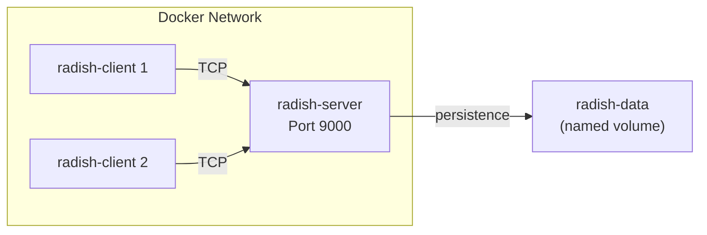

# Docker & Deployment

Radish can run entirely in Docker — no Julia installation needed. This makes it easy to demo, test, and deploy.

---

## Quick Start

```bash
# Build the image
docker compose build

# Start the server
docker compose up

# Connect a client (separate terminal)
docker compose run --rm radish-client
```

That's it. The server starts on port 9000 and the client connects automatically.

---

## Architecture

The Docker setup uses a single image for both server and client, with Docker Compose orchestrating the roles:



### Dockerfile

The Dockerfile uses Julia 1.11 as the base image and installs dependencies:

```dockerfile
FROM julia:1.11
WORKDIR /app
COPY . .
RUN julia --project=. -e 'using Pkg; Pkg.instantiate()'
```

### Docker Compose

```yaml
services:
  radish-server:
    build: .
    command: julia --project=. server_runner.jl 0.0.0.0 9000
    ports:
      - "9000:9000"
    volumes:
      - radish-data:/app/persistence
    healthcheck:
      test: ["CMD", "nc", "-z", "localhost", "9000"]
      interval: 10s

  radish-client:
    build: .
    command: julia --project=. client_runner.jl radish-server 9000
    stdin_open: true
    tty: true

volumes:
  radish-data:
```

---

## Key Design Decisions

### Health Checks

The health check uses `nc -z` (netcat zero-I/O mode) — a lightweight TCP probe that just checks if the port is open:

```yaml
healthcheck:
  test: ["CMD", "nc", "-z", "localhost", "9000"]
  interval: 10s
  timeout: 3s
  retries: 3
```

This avoids sending actual RESP commands for health checks. The server handles these connection-and-immediate-disconnect probes gracefully — the `ECONNRESET` from health check probes is caught and logged silently.

### Configuration

The server reads its [configuration](configuration) from `radish.yml` at startup. Inside Docker, the config file is baked into the image during the build. To use a custom config, you can mount it as a volume:

```yaml
volumes:
  - ./my-config.yml:/app/radish.yml
```

Note that when running in Docker, the `network.host` should be `0.0.0.0` (not `127.0.0.1`) to accept connections from other containers.

### Data Persistence

Data is stored in a Docker named volume (`radish-data`), which means:

- **Data survives** `docker compose down` → `docker compose up`
- **Data is isolated** from any local Radish instance running outside Docker
- **To wipe the database**: `docker compose down -v` (the `-v` flag removes volumes)

### The `.dockerignore`

The `.dockerignore` file keeps the image lean:

```
.git
persistence/
Manifest.toml
```

`persistence/` is excluded because the container uses its own volume. `Manifest.toml` is regenerated during the build by `Pkg.instantiate()`.

---

## Common Operations

| Action | Command |
|---|---|
| Build the image | `docker compose build` |
| Start server (foreground) | `docker compose up` |
| Start server (background) | `docker compose up -d` |
| Connect a client | `docker compose run --rm radish-client` |
| View server logs | `docker compose logs -f radish-server` |
| Run workload simulator (load + run) | `make simulator` |
| Run simulator load only | `make simload` |
| Run simulator run only | `make simrun` |
| Stop everything | `docker compose down` |
| Stop and wipe data | `docker compose down -v` |
| Rebuild after code changes | `docker compose build --no-cache` |

---

## Connecting from the Host

The server port is exposed on `localhost:9000`, so you can also connect from outside Docker:

```bash
# Using a local Julia client
julia client_runner.jl 127.0.0.1 9000

# Or any TCP tool
nc localhost 9000
```

---

## Workload Simulator

The workload simulator (`workload_simulator.jl`) generates realistic client traffic against a running Radish server. It exercises **every supported command** across all data types, making it useful for stress testing, performance profiling, and validating correctness under load.

### Modes

| Mode | Description |
|------|-------------|
| `load` | Preload a fixed number of keys into the DB, then exit |
| `run` | Execute random operations against existing keys |
| `loadrun` | Load keys first, then run operations |

### Docker Usage

```bash
make simulator   # load + run (default)
make simload     # load only
make simrun      # run only
```

With custom parameters:

```bash
# Small quick test
docker compose --profile simulator run --rm radish-simulator \
  julia --project=. workload_simulator.jl loadrun \
  --host radish-server --port 9000 \
  --num-clients 3 --num-keys 100 --num-ops 200

# Duration-based run (60 seconds)
docker compose --profile simulator run --rm radish-simulator \
  julia --project=. workload_simulator.jl run \
  --host radish-server --port 9000 \
  --duration 60 --num-clients 20

# Continuous load (Ctrl+C to stop)
docker compose --profile simulator run --rm radish-simulator \
  julia --project=. workload_simulator.jl run \
  --host radish-server --port 9000 \
  --forever --num-clients 50
```

### Local Usage (no Docker)

```bash
julia workload_simulator.jl loadrun --num-keys 1000 --num-ops 5000
julia workload_simulator.jl load --num-clients 5 --num-keys 10000
julia workload_simulator.jl run --duration 30 --num-clients 10
```

### CLI Options

| Option | Default | Description |
|--------|---------|-------------|
| `--num-clients N` | 10 | Concurrent client connections |
| `--num-keys N` | 5000 | Keys per type in load phase |
| `--num-ops N` | 10000 | Operations per client in run phase |
| `--duration T` | — | Run for T seconds instead of num-ops |
| `--forever` | — | Run indefinitely (Ctrl+C to stop) |
| `--host HOST` | 127.0.0.1 | Server host |
| `--port PORT` | 9000 | Server port |

### Load Phase

Creates `--num-keys` keys **per supported type** (currently: strings and lists):

- **TTL**: 50% of keys get a TTL between 10 min–1 hour; 50% are persistent
- **Content size**: Random between 5–500 (chars for strings, elements for lists)
- **Integer strings**: ~30% of string keys store integer values (for `S_INCR` and friends)
- **Key naming**: `str_1`, `str_2`, ... for strings; `list_1`, `list_2`, ... for lists

### Run Phase

Discovers existing keys via `KLIST`, then executes random operations with weighted probability:

| Category | Probability | Description |
|----------|-------------|-------------|
| Type-specific ops | ~75% | All string and list commands, weighted by key count |
| Transactions | ~10% | `MULTI` → 3–8 same-type ops → `EXEC` (20% `DISCARD`) |
| Meta ops | ~10% | `EXISTS`, `TYPE`, `TTL`, `PERSIST`, `EXPIRE`, `RENAME`, `DEL` |
| General ops | ~5% | `PING`, `DBSIZE`, `KLIST` |

Expired keys are automatically removed from the pool after 2 consecutive nils, with a full pool refresh every 5,000 operations. `FLUSHDB` is excluded.

### Adding a New Type

The simulator uses a **Type Registry** — adding a new Radish type requires only one entry:

```julia
const TYPE_REGISTRY = [
    (name = "string", prefix = "str",  create_fn = ..., ops = ..., tx_ops = ...),
    (name = "list",   prefix = "list", create_fn = ..., ops = ..., tx_ops = ...),
    # (name = "hash", prefix = "hash", create_fn = ..., ops = ..., tx_ops = ...),
]
```

The load and run phases iterate over this registry automatically.

