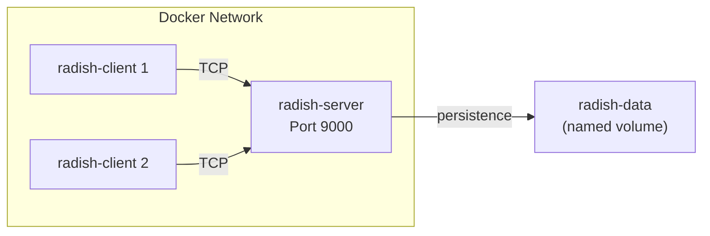

# Docker & Deployment

Radish can run entirely in Docker — no Julia installation needed. This makes it easy to demo, test, and deploy.

---

## Quick Start

```bash
# Build the image
docker compose build

# Start the server
docker compose up

# Connect a client (separate terminal)
docker compose run --rm radish-client
```

That's it. The server starts on port 9000 and the client connects automatically.

---

## Architecture

The Docker setup uses a single image for both server and client, with Docker Compose orchestrating the roles:



### Dockerfile

The Dockerfile uses Julia 1.11 as the base image and installs dependencies:

```dockerfile
FROM julia:1.11
WORKDIR /app
COPY . .
RUN julia --project=. -e 'using Pkg; Pkg.instantiate()'
```

### Docker Compose

```yaml
services:
  radish-server:
    build: .
    command: julia --project=. server_runner.jl 0.0.0.0 9000
    ports:
      - "9000:9000"
    volumes:
      - radish-data:/app/persistence
    healthcheck:
      test: ["CMD", "nc", "-z", "localhost", "9000"]
      interval: 10s

  radish-client:
    build: .
    command: julia --project=. client_runner.jl radish-server 9000
    stdin_open: true
    tty: true

volumes:
  radish-data:
```

---

## Key Design Decisions

### Health Checks

The health check uses `nc -z` (netcat zero-I/O mode) — a lightweight TCP probe that just checks if the port is open:

```yaml
healthcheck:
  test: ["CMD", "nc", "-z", "localhost", "9000"]
  interval: 10s
  timeout: 3s
  retries: 3
```

This avoids sending actual RESP commands for health checks. The server handles these connection-and-immediate-disconnect probes gracefully — the `ECONNRESET` from health check probes is caught and logged silently.

### Configuration

The server reads its [configuration](configuration) from `radish.yml` at startup. Inside Docker, the config file is baked into the image during the build. To use a custom config, you can mount it as a volume:

```yaml
volumes:
  - ./my-config.yml:/app/radish.yml
```

Note that when running in Docker, the `network.host` should be `0.0.0.0` (not `127.0.0.1`) to accept connections from other containers.

### Data Persistence

Data is stored in a Docker named volume (`radish-data`), which means:

- **Data survives** `docker compose down` → `docker compose up`
- **Data is isolated** from any local Radish instance running outside Docker
- **To wipe the database**: `docker compose down -v` (the `-v` flag removes volumes)

### The `.dockerignore`

The `.dockerignore` file keeps the image lean:

```
.git
persistence/
Manifest.toml
```

`persistence/` is excluded because the container uses its own volume. `Manifest.toml` is regenerated during the build by `Pkg.instantiate()`.

---

## Common Operations

| Action | Command |
|---|---|
| Build the image | `docker compose build` |
| Start server (foreground) | `docker compose up` |
| Start server (background) | `docker compose up -d` |
| Connect a client | `docker compose run --rm radish-client` |
| View server logs | `docker compose logs -f radish-server` |
| Stop everything | `docker compose down` |
| Stop and wipe data | `docker compose down -v` |
| Rebuild after code changes | `docker compose build --no-cache` |

---

## Connecting from the Host

The server port is exposed on `localhost:9000`, so you can also connect from outside Docker:

```bash
# Using a local Julia client
julia client_runner.jl 127.0.0.1 9000

# Or any TCP tool
nc localhost 9000
```
