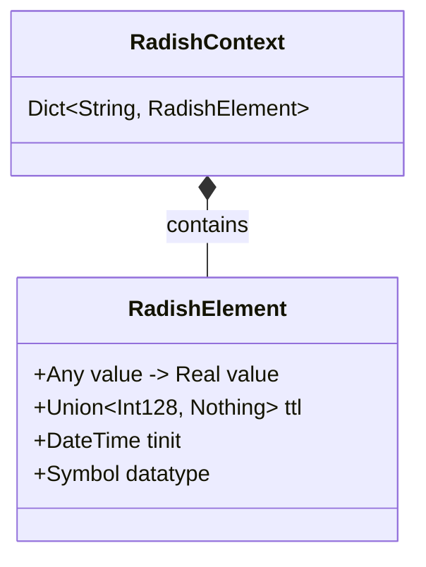

# 🌱 Radish


**Radish** is a didactical in-memory database inspired by [Redis](https://redis.io), built entirely in [Julia](https://julialang.org) with minor dependencies. It started as a learning exercise to understand how key-value stores work under the hood — and grew into an almost fully functional server with persistence, transactions, concurrent access, and a wire protocol.

### Dependencies

Radish deliberately keeps its dependency footprint small — most of the heavy lifting is done with Julia's standard library. Here's every dependency and why it's needed:

| Package | Type | Purpose |
|---------|------|---------|
| **Dates** | stdlib | Timestamps for `RadishElement.tinit` and TTL expiration calculations |
| **Sockets** | stdlib | TCP server and client — `listen()`, `accept()`, `connect()` for all network I/O |
| **Logging** | stdlib | Structured `@info`, `@warn`, `@debug` logging throughout the server |
| **JSON3** | external | Serialization of snapshot data to sharded `.rdb` files (one JSON object per key) |
| **StatsBase** | external | `sample()` function used by the background TTL cleaner to randomly sample keys for expiration checks |
| **ConcurrentUtilities** | external | Provides `ReadWriteLock` — the foundation of the [sharded locking](concurrency) system |
| **YAML** | external | Parses the [`radish.yml`](configuration) configuration file at startup |
| **JuliaFormatter** | dev only | Code formatting for development — not used at runtime |

{: .note }
> Only 4 external packages are used at runtime. Everything else — the data structures, the RESP protocol, the dispatcher, persistence — is built from scratch.


---
## Why Build an In-Memory Database?

At the beginning of this journey I was fascinated by Redis and its story, I was eager to revisit some computer science concepts I never deeply studied and I thought that building a Redis inspired database could satisfy my curiosity.

In particular, I wanted to deeply understand:

- **Data structure design** — how strings, lists, and hashes are stored and manipulated efficiently
- **Client-server architecture** — TCP sockets, wire protocols, request-response cycles
- **Persistence strategies** — trading off durability vs. performance (RDB snapshots, AOF logs)
- **Concurrency** — handling multiple clients safely without corrupting shared state
- **Systems thinking** — how all these pieces fit together into a coherent system

But more importantly **why** having such data structures available in a shared memory database is a powerful tool for software development.

Radish is in the first place a:
- **learning tool** — a way to explore these concepts by building them from scratch, challenging real world problems and use cases.
- **fun tool** — a way to have fun implementing ideas, and systems. Combine them to reach a sort of maturity of the platform and try to use them for other projects.

{: .note }
> Since this is a didactical project, much of the complexity found in well-established in-memory databases is not taken into consideration. Some features may be added in the future, but likely not all. When compromises are made, they will be listed as limitations under the specific section.


---

## Why Julia? (Why not?)

Honestly it was a random choice, Julia is a programming language I always heard about but never studied, so my thought was: why not?

With today's LLMs it's easy to pick up a new language and write something useful even if you are not proficient in it, knowledge will come at some point.


Eventually, Julia turned out to be an interesting choice for a project like this because it has:

1. **High-level expressiveness** — Julia's multiple dispatch system makes the [delegation pattern](architecture) feel natural (This was not known by me in the first place, so it was luck I guess)
2. **Performance** — Julia compiles to native code, making it viable for a server handling many concurrent connections
3. **Async I/O** — Julia's `@async` and task model work well for background processes, a lot of extra functionalities were developed in this way. Just to name a few: TTL cleanup and snapshot syncing.

---

## What Radish Implements

| Feature | Status | Description |
|---------|--------|-------------|
| [String Operations](data-structures) | ✅ | GET, SET, INCR, APPEND, LCS, padding, and more |
| [Linked Lists](data-structures) | ✅ | Custom doubly-linked list with O(1) push/pop |
| [RESP Protocol](resp-protocol) | ✅ | Redis Serialization Protocol for wire communication |
| [Persistence](persistence) | ✅ | Sharded RDB snapshots + AOF with crash recovery |
| [Transactions](transactions) | ✅ | MULTI/EXEC/DISCARD with atomic execution |
| [Configuration](configuration) | ✅ | YAML-based config for all tunable parameters |
| [Sharded Locking](concurrency) | ✅ | Configurable ReadWriteLocks for concurrent access |
| [TTL & Expiry](concurrency) | ✅ | Background cleaner with probabilistic sampling |
| [Docker Support](docker) | ✅ | Full Docker Compose setup with health checks |
| Key Management | ✅ | EXISTS, DEL, TYPE, TTL, PERSIST, EXPIRE, RENAME, FLUSHDB |

More data-structures are coming at some point, I had the feeling that resolving other issues was more valuable than adding overstudied data-types. Still I think that implementing those from scratch is quite fun.


---

## A quick look to the Architecture

At its core, Radish stores everything in a single dictionary:

```julia
RadishContext = Dict{String, RadishElement}
```

Every value is wrapped in a `RadishElement` that carries metadata:



Commands flow through a **delegation pattern** with two layers:

- **Hypercommands** — generic operations like `get`, `add`, or `remove` that work across all data types
- **Type commands** — concrete implementations of each hypercommand for a specific data type (e.g. `get` for strings vs. `get` for lists)

Then we have a [dispatcher](dispatcher) component, that receives a client request, resolves the matching hypercommand, and routes it to the correct type command based on the value's data type. This makes adding new data types straightforward — the first interface stays the same, no matter what types we are interacting with.

Read on to explore each component in detail →

---

{: .note }
> This documentation is itself a learning resource, or at least, it tries to be a good read. Each page wants to explain not just *what* Radish does, but *why* it was designed that way, *which* compromises were taken. Hopefully the reader can take something home from this guide (that would be very fulfilling for me)
