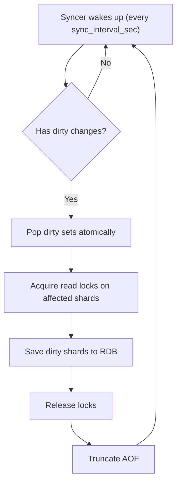

# Persistence

One of the core challenges of any in-memory database is **durability** — what happens when the server crashes or restarts? Radish implements a dual-strategy persistence model inspired by Redis: **RDB snapshots** for periodic full-state captures and **AOF (Append-Only File)** for real-time write logging.

On top of that another idea is to avoid full writes every time if you already know a lot of keys are the same. For doing that, Radish implements a **DirtyTracker** that tries to rewrite only the keys that are changed.

---

## The Durability Problem

An in-memory database is fast because it stores everything in RAM. But RAM is volatile — if the process dies, everything is gone. There are two fundamental approaches to solving this:

1. **Snapshotting** — periodically dump the entire database state to disk
2. **Write-ahead logging** — log every write operation as it happens

Each has trade-offs:

| Approach | Pros | Cons |
|---|---|---|
| RDB Snapshots | Compact, fast to load | Last few seconds of writes can be lost |
| AOF Log | No data loss (every write logged) | File grows unbounded, slower recovery |

Radish uses **both** — just like Redis. Snapshots provide the baseline, and AOF fills the gap between snapshots.

---

## Sharded RDB Snapshots

Instead of writing a single monolithic snapshot file, Radish partitions the database into **N shards** (configurable via [`num_snapshot_shards`](configuration)) and writes each shard to its own file:

```
persistence/snapshots/
├── shard_001.rdb
├── shard_002.rdb
├── ...
└── shard_256.rdb
```

Each key is assigned to a shard using a hash function:

```julia
snapshot_shard_id(key::String) = (hash(key) % CONFIG[].num_snapshot_shards) + 1
```

### Why Shard the Snapshots?

When only a few keys change, there's no reason to rewrite the entire database. Sharded snapshots enable **incremental saves** — only the shard files containing dirty keys are touched.

For example, if 10 keys change across 3 shards, Radish only rewrites those 3 shard files. The rest remain untouched. The savings depend entirely on how many shards are touched — the best case is a single dirty shard, which rewrites just 1 out of N files. The worst case is when writes are spread across all shards (e.g., a bulk load of uniformly distributed keys), which forces every shard file to be rewritten — equivalent to a full snapshot with a little extra overhead for managing more files instead of one. The number of shards is [configurable](configuration) (default: 256).

### Snapshot Format

Each line in a shard file is a JSON object:

```json
{"key": "user:1", "value": "Alice", "ttl": 3600, "datatype": "string"}
{"key": "user:2", "value": "Bob", "ttl": null, "datatype": "string"}
```

This is simple but effective — easy to debug, easy to parse, and human-readable.

### Atomic Writes

Snapshots are written atomically using a **temp file + rename** pattern:

```julia
temp_path = path * ".tmp"
open(temp_path, "w") do f
    for line in values(snapshot_lines)
        println(f, line)
    end
    flush(f)
end
mv(temp_path, path, force=true)
```

If the server crashes mid-write, the original shard file remains intact. The temp file is cleaned up on next startup.

{: .note }
> Redis uses the same temp-file-and-rename pattern for its RDB files, guaranteeing that a snapshot is either fully written or not written at all.

---

## Dirty Tracking

To know *which* shards need updating, Radish maintains a `DirtyTracker`:

```julia
mutable struct DirtyTracker
    modified::Set{String}    # Keys that were added/modified
    deleted::Set{String}     # Keys that were deleted
    lock::ReentrantLock      # Thread safety
end
```

Every hypercommand that modifies state calls `mark_dirty!(tracker, key)` or `mark_deleted!(tracker, key)`. The background syncer then **pops** these changes atomically and applies them to the snapshot files.

This design means the server never blocks waiting for disk I/O during normal operation — dirty tracking is just a `Set` insertion.

---

## AOF (Append-Only File)

Between snapshots, every write command is logged to an append-only file:

```
persistence/aof.radish/appendonly.aof
```

Each line records the full command:

```
S_SET user:1 Alice 3600
S_INCR counter
L_PREPEND queue job42
```

### Thread Safety

Multiple clients can write concurrently, so the AOF uses a `ReentrantLock`:

```julia
mutable struct AOFState
    path::String
    io::Union{IOStream, Nothing}
    lock::ReentrantLock
end
```

Every write is wrapped in `lock(aof.lock) do ... end`, ensuring commands are logged atomically. Transactions use `aof_append_batch!` to write all commands in a single locked section.

### AOF Truncation

After each successful snapshot sync, the AOF is truncated (emptied). This prevents unbounded growth — the snapshot already contains all the data, so the AOF only needs to capture writes *since the last snapshot*.

---

## Background Syncer

A background task runs periodically (configurable via [`sync_interval_sec`](configuration)):



Key design decisions:
- **Read locks only** — the syncer reads the current state without blocking writes (the data just needs to be consistent at snapshot time)
- **Affected shards only** — if 3 out of 256 shards are dirty, only those 3 shards' locks are acquired
- **Non-blocking** — the syncer runs in its own `@async` task, never blocking client operations

---

## Crash Recovery

On startup, Radish recovers in two steps:

1. **Load RDB snapshots** — reads all shard files and populates the `RadishContext`
2. **Replay AOF** — re-executes any commands logged since the last snapshot

```julia
count = load_snapshot!(ctx)                    # Step 1
aof_count = replay_aof!(ctx, db_lock)          # Step 2
```

This guarantees that the database state after recovery is identical to what it was before the crash (up to the last AOF-logged command).

---

## Graceful Shutdown

When the server receives `Ctrl+C`, it performs a full snapshot before exiting:

```julia
save_full_snapshot!(ctx, tracker)
```

This is a **full** snapshot (not incremental), ensuring that all data is captured. The AOF is then deleted since it's no longer needed.
