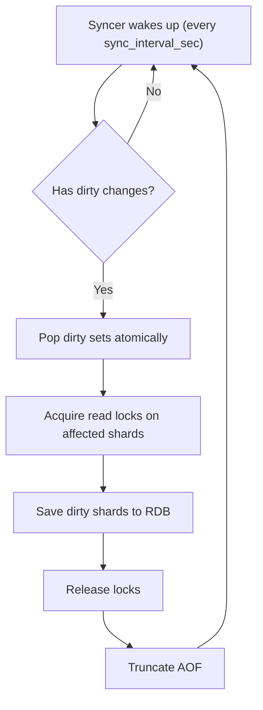

# Persistence

One of the core challenges of any in-memory database is **durability** — what happens when the server crashes or restarts? Radish implements a dual-strategy persistence model: **RDB snapshots** for periodic full-state captures and **AOF (Append-Only File)** for real-time write logging.

On top of that another idea is to avoid full writes every time if you already know a lot of keys are the same. For doing that, Radish implements a **DirtyTracker** that tries to rewrite only the keys that are changed.

---

## The Durability Problem

An in-memory database is fast because it stores everything in RAM. But RAM is volatile — if the process dies, everything is gone. There are two fundamental approaches to solving this:

1. **Snapshotting** — periodically dump the entire database state to disk
2. **Write-ahead logging** — log every write operation as it happens

Each has trade-offs:

| Approach | Pros | Cons |
|---|---|---|
| RDB Snapshots | Compact, fast to load | Last few seconds of writes can be lost |
| AOF Log | No data loss (every write logged) | File grows unbounded, slower recovery |

Radish uses **both**. Snapshots provide the baseline, and AOF fills the gap between snapshots.

---

## Sharded RDB Snapshots

Instead of writing a single monolithic snapshot file, Radish partitions the database into **N shards** (configurable via [`num_shards`](configuration)) and writes each shard to its own file:

```
persistence/snapshots/
├── shard_001.rdb
├── shard_002.rdb
├── ...
└── shard_256.rdb
```

Each key is assigned to a shard using a hash function:

```julia
snapshot_shard_id(key::String) = (hash(key) % CONFIG[].num_shards) + 1
```

### Why Shard the Snapshots?

When only a few keys change, there's no reason to rewrite the entire database. Sharded snapshots enable **incremental saves** — only the shard files containing dirty keys are touched.

For example, if 10 keys change across 3 shards, Radish only rewrites those 3 shard files. The rest remain untouched. The savings depend entirely on how many shards are touched — the best case is a single dirty shard, which rewrites just 1 out of N files. The worst case is when writes are spread across all shards (e.g., a bulk load of uniformly distributed keys), which forces every shard file to be rewritten — equivalent to a full snapshot with a little extra overhead for managing more files instead of one. The number of shards is [configurable](configuration) (default: 256).

### Snapshot Format

Each line in a shard file is a JSON object:

```json
{"key": "user:1", "value": "Alice", "ttl": 3600, "datatype": "string"}
{"key": "user:2", "value": "Bob", "ttl": null, "datatype": "string"}
```

This is simple but effective — easy to debug, easy to parse, and human-readable.

### Atomic Writes

Snapshots are written atomically using a **temp file + rename** pattern:

```julia
temp_path = path * ".tmp"
open(temp_path, "w") do f
    for line in values(snapshot_lines)
        println(f, line)
    end
    flush(f)
end
mv(temp_path, path, force=true)
```

If the server crashes mid-write, the original shard file remains intact. The temp file is cleaned up on next startup.

{: .note }
> The temp-file-and-rename pattern guarantees that a snapshot is either fully written or not written at all — a standard approach for atomic file operations.

---

## Dirty Tracking

### The Naive Alternative

The simplest persistence strategy is to dump the entire database to disk periodically — serialize every single key, every cycle, regardless of what changed. This is what a "full snapshot on timer" approach looks like:

1. Every 5 seconds, acquire a lock on the entire store
2. Iterate all keys (could be millions)
3. Serialize each one to disk
4. Release the lock

This works, but it's wasteful. If you have 1 million keys and only 50 changed since the last snapshot, you're still rewriting 999,950 keys for no reason. The disk I/O scales with total database size rather than write throughput, and the all-keys lock blocks clients for the entire serialization time.

### How Dirty Tracking Solves This

Radish takes a different approach: **track what changed, only persist the delta.**

The `DirtyTracker` is a lightweight bookkeeper that records which keys were modified or deleted since the last snapshot sync:

```julia
mutable struct DirtyTracker
    modified::Dict{String, Symbol}   # key => datatype at time of modification
    deleted::Dict{String, Symbol}    # key => datatype at time of deletion
    lock::ReentrantLock
end
```

Every hypercommand that modifies state calls `mark_dirty!(tracker, key, datatype)` or `mark_deleted!(tracker, key, datatype)`. These calls happen inline during command execution — they're just a dictionary insertion, costing nanoseconds.

### The Sync Cycle

When the background syncer wakes up (every [`sync_interval_sec`](configuration)), it:

1. **Pops** the dirty sets atomically — swaps them with fresh empty dicts under the lock. This is O(1) and takes microseconds regardless of how many keys are dirty.
2. **Computes affected shards** — hashes each dirty key to find which shard files need rewriting.
3. **Acquires read locks only on affected shards** — not the whole database, just the 3-5 shards that actually changed.
4. **Rewrites only those shard files** — serializes the current state of dirty shards to disk.
5. **Truncates the AOF** — the snapshot now covers everything, so the AOF can be emptied.

The key insight: if 50 keys changed across 3 shards, the syncer rewrites 3 out of 256 shard files. The other 253 remain untouched on disk.

### Why This Is Clever

| Metric | Full snapshot | Dirty tracking |
|---|---|---|
| Disk I/O per sync | O(total keys) | O(dirty keys) |
| Lock scope | All shards (blocking) | Only dirty shards (read lock) |
| Client impact | Blocked during entire serialize | Minimal — only affected shards briefly read-locked |
| Write amplification | 1M keys → 1M serialized | 50 dirty keys → 3 shards rewritten |
| Idle database cost | Full rewrite every cycle | Zero I/O (nothing dirty) |

The tracker also stores the **datatype** alongside each key. This tells the syncer which typed dictionary (`store.strings`, `store.lists`, `store.sets`) to read from when serializing — no need to probe all dicts looking for the key.

### The Pop-and-Swap Pattern

The `pop_changes!` function is the critical synchronization point between the hot path (client handlers marking keys dirty) and the cold path (syncer writing to disk):

```julia
function pop_changes!(tracker::DirtyTracker)
    lock(tracker.lock) do
        modified = tracker.modified
        deleted = tracker.deleted
        tracker.modified = Dict{String, Symbol}()
        tracker.deleted = Dict{String, Symbol}()
        return modified, deleted
    end
end
```

This swap is O(1) — it just moves two dict pointers. After the swap, client handlers write to fresh empty dicts (zero contention with the syncer), while the syncer processes the old dicts at its own pace without holding any lock.

### Edge Cases

- **Key modified then deleted in the same cycle** — appears in both `modified` and `deleted`. The syncer processes deletions after modifications, so the key is correctly removed from the shard file.
- **Same key modified multiple times** — only recorded once in `modified` (dict semantics — last write wins for the datatype symbol, but it doesn't matter because the syncer reads the *current* value from the store, not a cached one).
- **No dirty keys** — syncer checks `isempty(modified) && isempty(deleted)` and skips entirely. Zero disk I/O on idle databases.


---

## AOF (Append-Only File)

Between snapshots, every write command is logged to an append-only file:

```
persistence/aof/radish.aof
```

Each line records the full command:

```
S_SET user:1 Alice 3600
S_INCR counter
L_PREPEND queue job42
```

### Thread Safety

Multiple clients can write concurrently, so the AOF uses a `ReentrantLock`:

```julia
mutable struct AOFState
    path::String
    io::Union{IOStream, Nothing}
    lock::ReentrantLock
end
```

Every write is wrapped in `lock(aof.lock) do ... end`, ensuring commands are logged atomically. Transactions use `aof_append_batch!` to write all commands in a single locked section.

**AOF writes happen inside the shard lock critical section** — this guarantees that AOF order matches execution order. If two clients write to the same key, the one that acquires the shard lock first also writes to AOF first.

### AOF Truncation

After each successful snapshot sync, the AOF is truncated (emptied). This prevents unbounded growth — the snapshot already contains all the data, so the AOF only needs to capture writes *since the last snapshot*.

---

## Background Syncer

A background task runs periodically (configurable via [`sync_interval_sec`](configuration)):


```mermaid
graph TD
    A["Syncer wakes up (every sync_interval_sec)"] --> B{Has dirty changes?}
    B -->|No| A
    B -->|Yes| C["Pop dirty sets atomically"]
    C --> D["Acquire read locks on affected shards"]
    D --> E["Save dirty shards to RDB"]
    E --> F["Release locks"]
    F --> G["Truncate AOF"]
    G --> A
```

Key design decisions:
- **Read locks only** — the syncer reads the current state without blocking writes (the data just needs to be consistent at snapshot time)
- **Affected shards only** — if 3 out of 256 shards are dirty, only those 3 shards' locks are acquired
- **Non-blocking** — the syncer runs in its own `Threads.@spawn` task on a separate OS thread, never blocking client operations

---

## Crash Recovery

On startup, Radish recovers in two steps:

1. **Load RDB snapshots** — reads all shard files and populates the `RadishStore`
2. **Replay AOF** — re-executes any commands logged since the last snapshot

```julia
count = load_snapshot!(store)                    # Step 1
aof_count = replay_aof!(store, db_lock)          # Step 2
```

This guarantees that the database state after recovery is identical to what it was before the crash (up to the last AOF-logged command).

---

## Graceful Shutdown

When the server receives SIGINT (Ctrl+C) or SIGTERM (Docker stop), it performs a structured shutdown:

1. **Close the listening socket** — stop accepting new connections
2. **Signal background tasks** — set the SHUTDOWN atomic flag; cleaner, syncer, and AOF flusher exit their loops
3. **Wait for background tasks** to finish their current cycle
4. **Acquire all write locks** — blocks until every client handler releases its locks
5. **Save a full snapshot** under exclusive lock — no concurrent access possible
6. **Delete the AOF** — snapshot is complete, AOF is redundant

This ensures no data corruption from concurrent access during the final snapshot. The SIGTERM handler (in `server_runner.jl`) converts Docker's stop signal into Julia's `InterruptException` so the same graceful path runs in containers.
