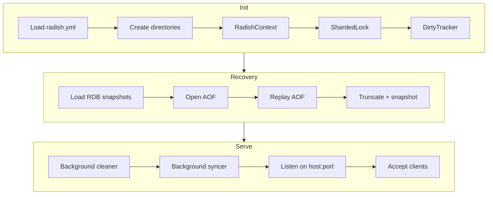
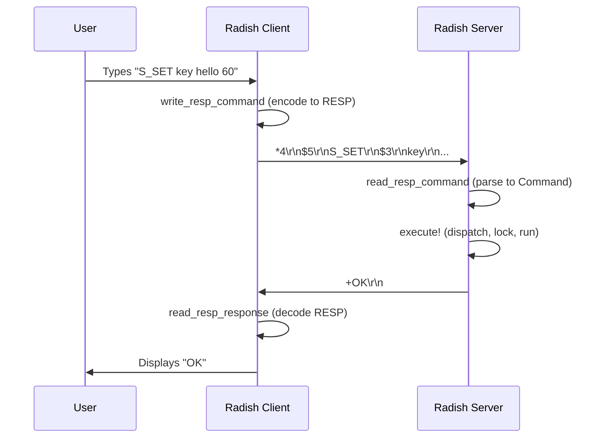

# Server & Client

<span class="label label-purple">Heavily AI Assisted</span>

Radish follows a classic **TCP client-server architecture**. The server listens for connections on a configurable host and port, spawning a new async task for each client. The client provides an interactive REPL for sending commands and displaying responses.

---

## Server Architecture

### Startup Sequence

When you run `julia server_runner.jl`, the server initializes in this order:



### Per-Client Handling

Each client gets its own `@async` task:

```julia
while true
    client = accept(server)
    client_counter += 1
    @async handle_client(client, ctx, db_lock, tracker, aof, client_counter)
end
```

The `handle_client` function:

1. **Sends a welcome message** — `+Welcome to Radish Server\r\n`
2. **Creates a `ClientSession`** — tracks transaction state per client
3. **Enters the read loop** — reads RESP commands, dispatches, writes responses
4. **Handles disconnection** — `EOFError`, broken pipes, `QUIT`/`EXIT` commands

```julia
function handle_client(sock, ctx, db_lock, tracker, aof, client_id)
    write(sock, "+Welcome to Radish Server\r\n")
    session = ClientSession()

    while isopen(sock)
        cmd = read_resp_command(sock)
        result = execute!(ctx, db_lock, cmd, session; tracker=tracker)

        # Log to AOF (write commands only)
        if should_log_to_aof(cmd)
            aof_append!(aof, cmd)
        end

        write_resp_response(sock, result)
    end
end
```

### Connection Resilience

The server gracefully handles common disconnection scenarios:

| Event | Handling |
|---|---|
| `EOFError` | Client disconnected normally → log and clean up |
| Broken pipe (`-32`) | Client closed connection mid-write → log and clean up |
| Connection reset (`-104`) | Network interruption → log and clean up |
| Health check probe | Docker's `nc -z` probes cause `ECONNRESET` → handled silently |

### Graceful Shutdown

On `Ctrl+C` (InterruptException), the server:

1. **Saves a full snapshot** — captures all current state to RDB
2. **Deletes the AOF** — unnecessary since snapshot is complete
3. **Closes the TCP server** — stops accepting new connections
4. **Prints goodbye** — `Radish server stopped. Goodbye!`

---

## Client Architecture

### Interactive REPL

The client provides a command-line interface with an interactive read-eval-print loop:

```
🌱 Connecting to Radish server at 127.0.0.1:9000...
✅ Welcome to Radish Server
Type 'HELP' for commands or 'QUIT' to disconnect

RADISH-CLI> S_SET greeting hello
OK
RADISH-CLI> S_GET greeting
✅ hello
RADISH-CLI>
```

### Client-Side vs Server-Side Commands

Not all commands hit the server:

| Command | Handled By | Behavior |
|---|---|---|
| `HELP` | Client | Displays the full command reference locally |
| `QUIT` / `EXIT` | Both | Sent to server, then client disconnects |
| Everything else | Server | Encoded as RESP, sent over TCP |

### Command Flow



### Connection Management

The client uses simple but robust connection handling:

```julia
function start_client(host="127.0.0.1", port=9000)
    sock = connect(host, port)

    # Read welcome
    welcome = readline(sock)

    # REPL loop
    while isopen(sock)
        print("RADISH-CLI> ")
        line = readline()
        write_resp_command(sock, line)
        response = read_resp_response(sock)
        println(response)
    end
end
```

If the server goes down, the client detects the closed socket and exits with a clear error message. `Ctrl+C` in the client triggers a clean disconnect.

---

## Multiple Clients

Radish supports multiple concurrent clients out of the box:

```bash
# Terminal 1: Start server
julia server_runner.jl

# Terminal 2: Client A
julia client_runner.jl

# Terminal 3: Client B
julia client_runner.jl
```

All clients share the same `RadishContext`. The [sharded locking](concurrency) system ensures safe concurrent access. Each client has an independent `ClientSession`, so one client's transaction doesn't affect another.

---

## Configuration

All server parameters are managed through a single YAML file (`radish.yml`). See the [Configuration](configuration) page for the full reference.

Both the server and client accept command-line arguments that **override** the config file values:

```bash
# Use defaults from radish.yml
julia server_runner.jl

# Override host and port
julia server_runner.jl 0.0.0.0 9000

# Use a custom config file
julia server_runner.jl 0.0.0.0 9000 /path/to/custom.yml

# Client follows the same pattern
julia client_runner.jl 127.0.0.1 9000
```
