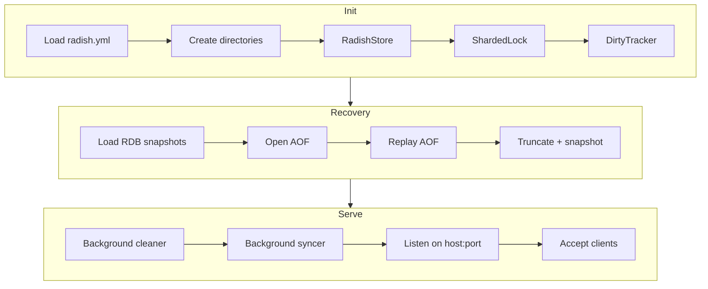
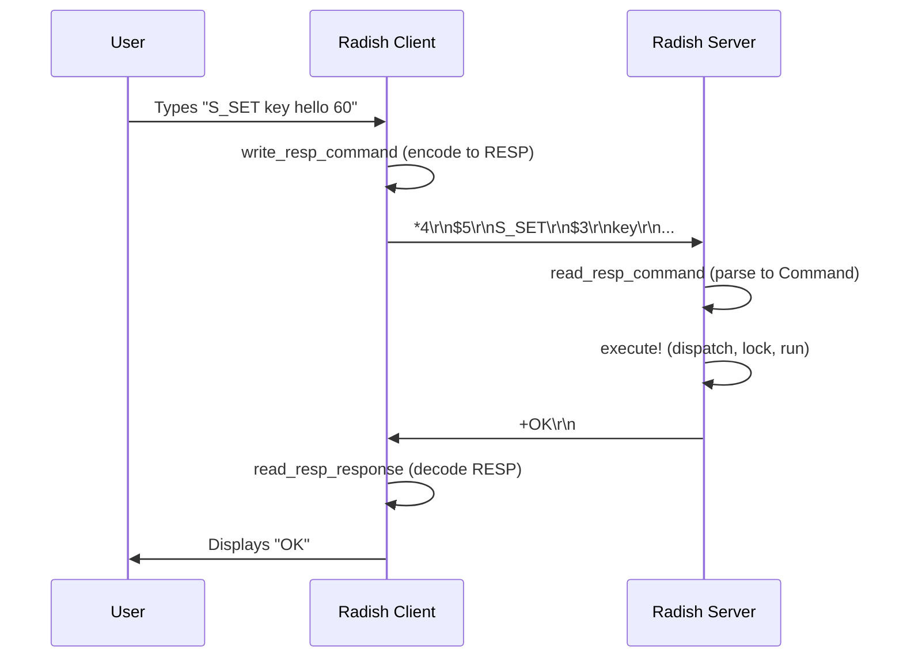

# Server & Client

<span class="label label-purple">Heavily AI Assisted</span>

Radish follows a classic **TCP client-server architecture**. The server listens for connections on a configurable host and port, spawning a new async task for each client. The client provides an interactive REPL for sending commands and displaying responses.

---

## Server Architecture

### Startup Sequence

When you run `julia server_runner.jl`, the server initializes in this order:


```mermaid
graph TD
    subgraph Init
        direction LR
        Z["Load radish.yml"] --> A["Create directories"] --> B["RadishStore"] --> C["ShardedLock"] --> D["DirtyTracker"]
    end

    subgraph Recovery
        direction LR
        E["Load RDB snapshots"] --> F["Open AOF"] --> G["Replay AOF"] --> H["Truncate + snapshot"]
    end

    subgraph Serve
        direction LR
        I["Background cleaner"] --> J["Background syncer"] --> K["Listen on host:port"] --> L["Accept clients"]
    end

    Init --> Recovery --> Serve
```

### Per-Client Handling

Each client gets its own `Threads.@spawn` task (on a separate OS thread):

```julia
while true
    client = accept(server)
    client_counter += 1
    @spawn handle_client(client, store, db_lock, tracker, aof, client_counter)
end
```

The `handle_client` function:

1. **Sends a welcome message** — `+Welcome to Radish Server\r\n`
2. **Creates a `ClientSession`** — tracks transaction state per client
3. **Enters the read loop** — reads RESP commands, dispatches, writes responses
4. **Detects pipelining** — if multiple commands are buffered, uses batch execution with combined locking
5. **Handles disconnection** — `EOFError`, broken pipes, `QUIT`/`EXIT` commands

AOF writes happen inside the lock critical section (inside `execute!` and `execute_batch!`), guaranteeing that AOF order matches execution order.

### Connection Resilience

The server gracefully handles common disconnection scenarios:

| Event | Handling |
|---|---|
| `EOFError` | Client disconnected normally → log and clean up |
| Broken pipe (`-32`) | Client closed connection mid-write → log and clean up |
| Connection reset (`-104`) | Network interruption → log and clean up |
| Health check probe | Docker's `nc -z` probes cause `ECONNRESET` → handled silently |

### Graceful Shutdown

On `Ctrl+C` (InterruptException) or SIGTERM (Docker stop), the server:

1. **Closes the listening socket** — stops accepting new connections
2. **Signals background tasks** to stop via an atomic SHUTDOWN flag
3. **Waits for background tasks** to finish their current cycle
4. **Acquires all write locks** — blocks until all client handlers release
5. **Saves a full snapshot** under exclusive lock — no concurrent access
6. **Deletes the AOF** — snapshot is complete
7. **Prints goodbye** — `Radish server stopped. Goodbye!`

---

## Client Architecture

### Interactive CLI

The client provides a command-line interface with interactive line editing, built using raw terminal mode:

```
🌱 Connecting to Radish server at 127.0.0.1:9000...
✅ Welcome to Radish Server
Type 'HELP' for commands, Tab to complete, or 'QUIT' to disconnect

RADISH-CLI> S_SET greeting hello
OK
RADISH-CLI> S_GET greeting
✅ hello
RADISH-CLI>
```

Features:
- Tab completion for all command names (type `S_` then Tab to see string commands)
- Command history with up/down arrows (skips consecutive duplicates)
- Left/right arrow cursor movement, Home/End keys
- Backspace and Delete at any cursor position
- Ctrl+L or `CLEAR` command to clear the screen
- Ctrl+C for clean disconnect

### Client-Side vs Server-Side Commands

Not all commands hit the server:

| Command | Handled By | Behavior |
|---|---|---|
| `HELP` | Client | Displays the full command reference locally |
| `CLEAR` | Client | Clears the terminal screen |
| `QUIT` / `EXIT` | Both | Sent to server, then client disconnects |
| Everything else | Server | Encoded as RESP, sent over TCP |

### Command Flow


```mermaid
sequenceDiagram
    participant User
    participant Client as Radish Client
    participant Server as Radish Server

    User->>Client: Types "S_SET key hello 60"
    Client->>Client: write_resp_command (encode to RESP)
    Client->>Server: *4\r\n$5\r\nS_SET\r\n$3\r\nkey\r\n...
    Server->>Server: read_resp_command (parse to Command)
    Server->>Server: execute! (dispatch, lock, run)
    Server->>Client: +OK\r\n
    Client->>Client: read_resp_response (decode RESP)
    Client->>User: Displays "OK"
```

### Connection Management

The client uses raw terminal mode (`stty`) for character-at-a-time input, enabling arrow keys, tab completion, and history. Terminal mode is always restored in a `finally` block, even on crashes:

```julia
function start_client(host="127.0.0.1", port=9000)
    sock = connect(host, port)
    welcome = readline(sock)
    history = String[]

    enable_raw_mode()
    try
        while isopen(sock)
            line = read_line_interactive("RADISH-CLI> ", history)
            # ... handle local commands, send to server, display response
        end
    finally
        disable_raw_mode()
        close(sock)
    end
end
```

If the server goes down, the client detects the closed socket and exits with a clear error message. `Ctrl+C` in the client triggers a clean disconnect.

---

## Multiple Clients

Radish supports multiple concurrent clients out of the box:

```bash
# Terminal 1: Start server
julia server_runner.jl

# Terminal 2: Client A
julia client_runner.jl

# Terminal 3: Client B
julia client_runner.jl
```

All clients share the same `RadishStore`. The [sharded locking](concurrency) system ensures safe concurrent access. Each client has an independent `ClientSession`, so one client's transaction doesn't affect another.

---

## Configuration

All server parameters are managed through a single YAML file (`radish.yml`). See the [Configuration](configuration) page for the full reference.

Both the server and client accept command-line arguments that **override** the config file values:

```bash
# Use defaults from radish.yml
julia server_runner.jl

# Override host and port
julia server_runner.jl 0.0.0.0 9000

# Use a custom config file
julia server_runner.jl 0.0.0.0 9000 /path/to/custom.yml

# Client follows the same pattern
julia client_runner.jl 127.0.0.1 9000
```
