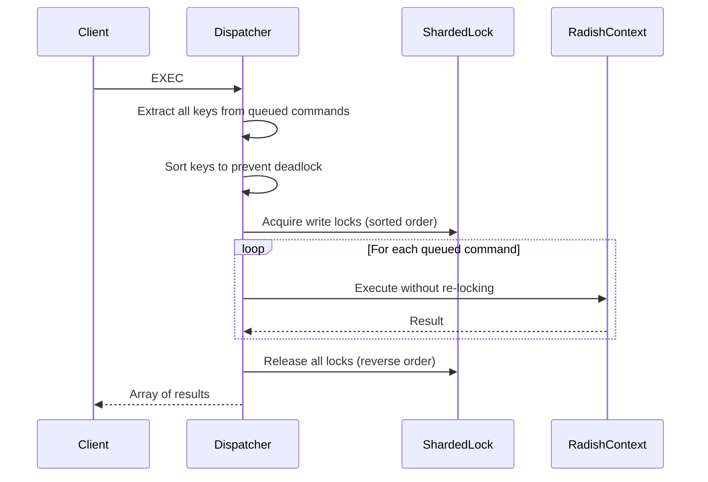

# Transactions

Radish supports Redis-style transactions using `MULTI`, `EXEC`, and `DISCARD`. Transactions provide **atomicity** — a group of commands executes as a single indivisible unit, with no other client's commands interleaved.

---

## Why Transactions?

Consider a simple bank transfer:

```
S_SET account_A 1000
S_SET account_B 500
```

To transfer 100 from A to B, you need three operations:
1. Read A's balance
2. Decrement A by 100
3. Increment B by 100

Without transactions, another client could modify A between steps 1 and 2, leading to an incorrect final state. Transactions solve this by guaranteeing that all three operations happen atomically.

---

## How to Use Them

### Basic Flow

```
RADISH-CLI> MULTI                  # Start transaction
OK

RADISH-CLI> S_SET mykey hello      # Commands are queued, not executed
QUEUED

RADISH-CLI> S_GET mykey
QUEUED

RADISH-CLI> EXEC                   # Execute all at once
✅ [OK, hello]
```

### Counter Increment

```
RADISH-CLI> S_SET counter 10
OK

RADISH-CLI> MULTI
OK

RADISH-CLI> S_INCR counter
QUEUED

RADISH-CLI> S_INCR counter
QUEUED

RADISH-CLI> S_GET counter
QUEUED

RADISH-CLI> EXEC
✅ [true, true, 12]
```

### Aborting a Transaction

```
RADISH-CLI> MULTI
OK

RADISH-CLI> S_SET key value
QUEUED

RADISH-CLI> DISCARD               # Clear the queue, nothing happens
OK

RADISH-CLI> S_GET key
✅ (nil)                           # Key was never set
```

---

## Implementation Details

### Client Session State

Each client connection maintains a `ClientSession`:

```julia
mutable struct ClientSession
    in_transaction::Bool
    queued_commands::Vector{Command}
end
```

When `in_transaction == true`, the [dispatcher](dispatcher) queues commands instead of executing them immediately, returning `QUEUED` to the client.

### Atomic Execution

When `EXEC` is called, the transaction executes in these steps:



### Preventing Deadlock

The critical detail is **sorted lock acquisition**. If Transaction A locks key `apple` then `banana`, and Transaction B locks `banana` then `apple`, they would deadlock. By always acquiring locks in sorted order, this is impossible.

```julia
function extract_all_keys(commands::Vector{Command})
    keys = String[]
    for cmd in commands
        if cmd.key !== nothing
            push!(keys, cmd.key)
        end
        # Multi-key operations (S_LCS, L_MOVE, etc.)
        if cmd.name in MULTI_KEY_OPS && !isempty(cmd.args)
            push!(keys, cmd.args[1])
        end
    end
    return keys
end
```

### No Rollback

Like Redis, Radish transactions have **no rollback**. If one command in the transaction fails (e.g., type mismatch), the other commands still execute. The error is included in the result array.

This is a deliberate design choice:
- Commands typically only fail due to **programming errors** (wrong type, wrong arguments), not runtime conditions
- Rollback would add significant complexity with little practical benefit
- Redis doesn't support rollback either, and it works well in practice

---

## Error Handling

| Situation | Behavior |
|---|---|
| `EXEC` without `MULTI` | Returns error |
| `DISCARD` without `MULTI` | Returns error |
| Command fails during `EXEC` | Error included in result array, other commands continue |
| All commands succeed | Array of results returned |

---

## Limitations

- **No WATCH/UNWATCH** — Redis's optimistic locking is not yet implemented
- **Write locks for everything** — even read operations within a transaction acquire write locks (simpler but more restrictive)
- **No partial rollback** — if a command fails, there's no undo
